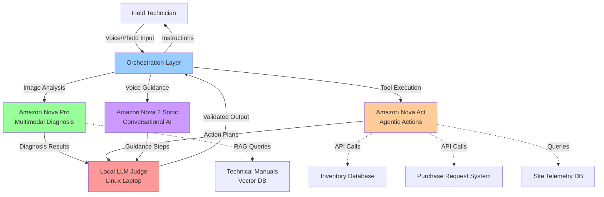
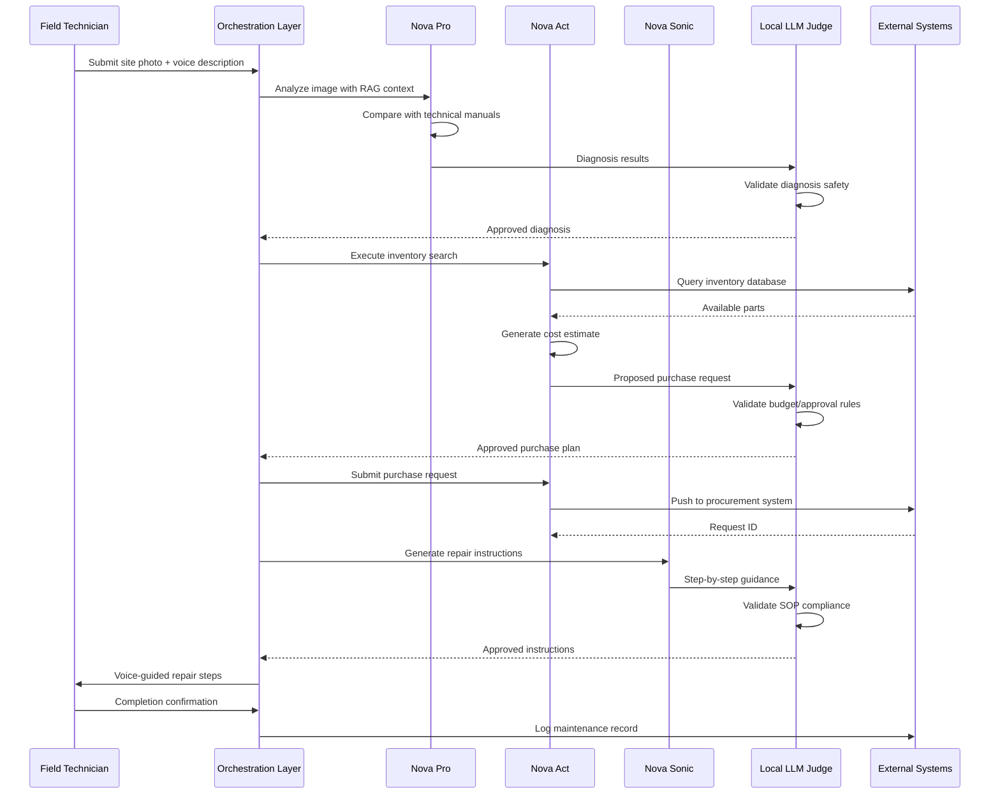

# Design Document: Autonomous Site & Infrastructure Engineer

## Overview

The Autonomous Field Engineer is a cyber-physical AI agent system that transforms reactive facility maintenance into proactive, automated operations. The system bridges digital IT support and physical infrastructure maintenance by combining multimodal visual diagnosis (Amazon Nova Pro), agentic tool-calling execution (Amazon Nova Act), conversational voice guidance (Amazon Nova 2 Sonic), and a local LLM judge for quality assurance and safety validation. This agent automates site surveys, hardware diagnostics, parts procurement, and provides real-time repair guidance to field technicians, reducing operational downtime and administrative overhead while maintaining strict safety and SOP compliance.

## Architecture

The system follows a multi-agent orchestration pattern with specialized AI models handling distinct responsibilities, coordinated through a central orchestration layer with local validation.




## System Workflow




## Components and Interfaces

### Component 1: Orchestration Layer

**Purpose**: Central coordinator that routes requests to specialized AI agents, manages workflow state, and enforces validation through the local LLM judge.

**Interface**:
```typescript
interface OrchestrationLayer {
  // Main entry point for field technician interactions
  processFieldRequest(request: FieldRequest): Promise<FieldResponse>
  
  // Route to specialized agents
  routeToDiagnosisAgent(imageData: ImageData, context: string): Promise<DiagnosisResult>
  routeToActionAgent(action: ActionRequest): Promise<ActionResult>
  routeToGuidanceAgent(scenario: RepairScenario): Promise<GuidanceSteps>
  
  // Validation through local judge
  validateWithJudge(output: AgentOutput, validationType: ValidationType): Promise<ValidationResult>
  
  // State management
  getWorkflowState(sessionId: string): WorkflowState
  updateWorkflowState(sessionId: string, state: WorkflowState): void
}

type FieldRequest = {
  sessionId: string
  technicianId: string
  siteId: string
  requestType: 'diagnosis' | 'guidance' | 'procurement'
  imageData?: ImageData
  voiceInput?: AudioData
  telemetryData?: TelemetrySnapshot
}

type FieldResponse = {
  sessionId: string
  status: 'success' | 'pending' | 'error'
  diagnosis?: DiagnosisResult
  actions?: ActionResult[]
  guidance?: GuidanceSteps
  validationStatus: ValidationResult
}
```

**Responsibilities**:
- Accept multimodal input from field technicians (photos, voice, telemetry)
- Route requests to appropriate specialized agents
- Coordinate multi-step workflows (diagnosis → procurement → guidance)
- Enforce validation gates through local LLM judge
- Maintain session state and context across interactions
- Handle error recovery and fallback strategies


### Component 2: Multimodal Diagnosis Agent (Amazon Nova Pro)

**Purpose**: Analyze site photos and telemetry data to identify hardware defects, installation errors, and infrastructure issues by comparing against technical reference materials.

**Interface**:
```typescript
interface DiagnosisAgent {
  // Primary diagnosis method
  diagnoseIssue(input: DiagnosisInput): Promise<DiagnosisResult>
  
  // RAG-based comparison with technical manuals
  compareWithReferenceMaterials(imageData: ImageData, equipmentType: string): Promise<ComparisonResult>
  
  // Analyze telemetry patterns
  analyzeTelemetry(telemetry: TelemetrySnapshot, historicalData: TimeSeriesData): Promise<TelemetryAnalysis>
  
  // Multi-issue detection
  detectMultipleIssues(imageData: ImageData): Promise<IssueList>
}

type DiagnosisInput = {
  imageData: ImageData
  equipmentType?: string
  siteContext: SiteContext
  telemetryData?: TelemetrySnapshot
  technicianNotes?: string
}

type DiagnosisResult = {
  issueId: string
  issueType: 'hardware_defect' | 'installation_error' | 'network_failure' | 'electrical_malfunction' | 'environmental'
  severity: 'critical' | 'high' | 'medium' | 'low'
  confidence: number // 0.0 to 1.0
  description: string
  affectedComponents: Component[]
  rootCause: string
  visualEvidence: AnnotatedImage
  referenceManualSections: ManualReference[]
  recommendedActions: Action[]
}

type ComparisonResult = {
  deviationsFound: Deviation[]
  complianceStatus: 'compliant' | 'non_compliant' | 'partial'
  referenceImages: ReferenceImage[]
  annotatedDifferences: AnnotatedImage
}
```

**Responsibilities**:
- Process high-resolution site photos and identify visual anomalies
- Query RAG system with technical manual embeddings for reference comparisons
- Detect hardware defects (damaged components, wear patterns, corrosion)
- Identify installation errors (incorrect wiring, improper mounting, missing components)
- Analyze network and electrical telemetry for failure patterns
- Generate confidence scores for each diagnosis
- Annotate images with identified issues and reference callouts


### Component 3: Agentic Action Agent (Amazon Nova Act)

**Purpose**: Execute tool-calling operations to search inventory, generate cost estimates, submit purchase requests, and interact with enterprise systems.

**Interface**:
```typescript
interface ActionAgent {
  // Tool orchestration
  executeToolChain(actions: Action[]): Promise<ActionResult[]>
  
  // Inventory management
  searchInventory(partSpecs: PartSpecification[]): Promise<InventorySearchResult>
  checkPartAvailability(partNumber: string, quantity: number): Promise<AvailabilityStatus>
  
  // Cost estimation
  generateCostEstimate(parts: Part[], labor: LaborEstimate): Promise<CostEstimate>
  
  // Procurement
  createPurchaseRequest(request: PurchaseRequestData): Promise<PurchaseRequest>
  submitToApprovalWorkflow(request: PurchaseRequest): Promise<ApprovalStatus>
  
  // Telemetry queries
  queryTelemetryDatabase(siteId: string, timeRange: TimeRange, metrics: string[]): Promise<TelemetryData>
}

type Action = {
  actionId: string
  actionType: 'inventory_search' | 'cost_estimate' | 'purchase_request' | 'telemetry_query'
  parameters: Record<string, any>
  dependencies: string[] // IDs of actions that must complete first
  retryPolicy: RetryPolicy
}

type ActionResult = {
  actionId: string
  status: 'success' | 'failure' | 'partial'
  data: any
  executionTime: number
  errors?: Error[]
}

type InventorySearchResult = {
  matchedParts: Part[]
  alternativeParts: Part[]
  leadTimes: Map<string, number> // partNumber -> days
  suppliers: Supplier[]
}

type PurchaseRequest = {
  requestId: string
  parts: Part[]
  totalCost: number
  justification: string
  urgency: 'emergency' | 'urgent' | 'normal' | 'low'
  siteId: string
  technicianId: string
  approvalStatus: 'pending' | 'approved' | 'rejected'
  estimatedDelivery: Date
}
```

**Responsibilities**:
- Execute multi-step tool chains with dependency management
- Search internal inventory databases for required parts
- Calculate total cost estimates including parts, shipping, and labor
- Generate purchase requests with proper justification and urgency levels
- Submit requests to management approval workflows
- Query site telemetry databases for diagnostic data
- Handle API authentication and rate limiting
- Implement retry logic for transient failures


### Component 4: Conversational Guidance Agent (Amazon Nova 2 Sonic)

**Purpose**: Provide hands-free, voice-activated repair instructions to field technicians with real-time SOP compliance and safety validation.

**Interface**:
```typescript
interface GuidanceAgent {
  // Generate repair instructions
  generateRepairGuide(diagnosis: DiagnosisResult, technicianSkillLevel: SkillLevel): Promise<RepairGuide>
  
  // Voice interaction
  processVoiceCommand(audio: AudioData, context: RepairContext): Promise<VoiceResponse>
  synthesizeSpeech(text: string, urgency: 'normal' | 'warning' | 'critical'): Promise<AudioData>
  
  // Step-by-step guidance
  getNextStep(currentStep: number, context: RepairContext): Promise<GuidanceStep>
  handleStepConfirmation(stepId: string, outcome: 'success' | 'failure' | 'skip'): Promise<NextAction>
  
  // Safety monitoring
  validateSafetyCompliance(proposedAction: string, siteContext: SiteContext): Promise<SafetyValidation>
}

type RepairGuide = {
  guideId: string
  issueId: string
  steps: GuidanceStep[]
  estimatedDuration: number // minutes
  requiredTools: Tool[]
  safetyWarnings: SafetyWarning[]
  sopReferences: SOPReference[]
  skillLevelRequired: SkillLevel
}

type GuidanceStep = {
  stepNumber: number
  instruction: string
  voiceScript: string
  visualAid?: ImageReference
  safetyChecks: string[]
  expectedOutcome: string
  troubleshootingTips: string[]
  estimatedTime: number // minutes
}

type VoiceResponse = {
  transcription: string
  intent: 'next_step' | 'repeat' | 'clarification' | 'emergency' | 'completion'
  audioResponse: AudioData
  textResponse: string
  requiresHumanEscalation: boolean
}

type SafetyValidation = {
  isCompliant: boolean
  violations: SafetyViolation[]
  requiredPPE: string[]
  environmentalHazards: string[]
  lockoutTagoutRequired: boolean
}
```

**Responsibilities**:
- Generate step-by-step repair instructions tailored to technician skill level
- Process voice commands for hands-free operation in field environments
- Synthesize clear, contextual audio responses with appropriate urgency
- Validate all guidance against safety protocols and SOPs
- Provide real-time troubleshooting when steps fail
- Reference technical manuals and integrate visual aids
- Detect emergency situations and trigger escalation protocols


### Component 5: Local LLM Judge (Critical Validation Layer)

**Purpose**: Hosted on a Linux-based laptop, this local LLM serves as an independent validation layer that ensures all AI agent outputs meet safety standards, SOP compliance, budget constraints, and quality thresholds before execution.

**Interface**:
```typescript
interface LocalLLMJudge {
  // Primary validation method
  validateAgentOutput(output: AgentOutput, validationCriteria: ValidationCriteria): Promise<JudgmentResult>
  
  // Specialized validation methods
  validateDiagnosisSafety(diagnosis: DiagnosisResult): Promise<SafetyJudgment>
  validateSOPCompliance(guidance: RepairGuide): Promise<ComplianceJudgment>
  validateBudgetConstraints(purchaseRequest: PurchaseRequest, limits: BudgetLimits): Promise<BudgetJudgment>
  validateActionPlan(actions: Action[]): Promise<PlanJudgment>
  
  // Escalation detection
  detectEscalationNeeded(context: WorkflowContext): Promise<EscalationDecision>
  
  // Audit logging
  logJudgment(judgment: JudgmentResult): Promise<void>
}

type AgentOutput = {
  agentType: 'diagnosis' | 'action' | 'guidance'
  outputData: any
  confidence: number
  timestamp: Date
  sessionId: string
}

type ValidationCriteria = {
  safetyRules: SafetyRule[]
  sopPolicies: SOPPolicy[]
  budgetLimits: BudgetLimits
  qualityThresholds: QualityThreshold[]
  regulatoryRequirements: RegulatoryRequirement[]
}

type JudgmentResult = {
  approved: boolean
  confidence: number
  reasoning: string
  violations: Violation[]
  recommendations: string[]
  requiresHumanReview: boolean
  escalationLevel?: 'none' | 'supervisor' | 'safety_officer' | 'management'
}

type SafetyJudgment = {
  isSafe: boolean
  hazardsIdentified: Hazard[]
  requiredPrecautions: string[]
  ppeRequired: string[]
  lockoutTagoutNeeded: boolean
  permitRequired: boolean
}

type ComplianceJudgment = {
  isCompliant: boolean
  sopViolations: SOPViolation[]
  missingSteps: string[]
  deviationsFromStandard: Deviation[]
  approvedWithConditions: boolean
  conditions?: string[]
}

type BudgetJudgment = {
  withinBudget: boolean
  totalCost: number
  budgetLimit: number
  approvalLevelRequired: 'technician' | 'supervisor' | 'manager' | 'director'
  costBreakdown: CostBreakdown
  alternativesConsidered: boolean
}
```

**Responsibilities**:
- Validate all AI agent outputs before execution or delivery to technician
- Enforce safety protocols and identify hazardous recommendations
- Check SOP compliance for all repair guidance
- Validate budget constraints and approval authority levels
- Detect situations requiring human escalation
- Maintain audit trail of all validation decisions
- Run locally on technician's laptop for offline capability and data privacy
- Provide reasoning for all approval/rejection decisions

**Deployment Architecture**:
- Hosted on Linux-based laptop (Ubuntu/Fedora)
- Model: Llama 3.1 8B or similar efficient local model
- Inference: llama.cpp or Ollama for CPU/GPU optimization
- Storage: Local SQLite database for audit logs
- Network: Can operate offline; syncs audit logs when connected


### Component 6: RAG System for Technical Manuals

**Purpose**: Vector database and retrieval system for technical documentation, equipment manuals, wiring diagrams, and reference images.

**Interface**:
```typescript
interface RAGSystem {
  // Document ingestion
  ingestManual(manual: TechnicalManual): Promise<void>
  ingestReferenceImages(images: ReferenceImage[]): Promise<void>
  
  // Retrieval
  retrieveRelevantSections(query: string, equipmentType: string, topK: number): Promise<ManualSection[]>
  retrieveSimilarImages(queryImage: ImageData, topK: number): Promise<ReferenceImage[]>
  
  // Hybrid search
  hybridSearch(textQuery: string, imageQuery: ImageData): Promise<SearchResult[]>
}

type TechnicalManual = {
  manualId: string
  equipmentType: string
  manufacturer: string
  modelNumber: string
  version: string
  sections: ManualSection[]
  diagrams: Diagram[]
  specifications: Specification[]
}

type ManualSection = {
  sectionId: string
  title: string
  content: string
  embedding: number[] // Vector embedding
  images: ImageReference[]
  relevanceScore?: number
}

type ReferenceImage = {
  imageId: string
  equipmentType: string
  viewAngle: string
  annotations: Annotation[]
  embedding: number[] // CLIP or similar multimodal embedding
  metadata: ImageMetadata
}
```

**Responsibilities**:
- Store and index technical manuals, SOPs, and reference materials
- Generate embeddings for text and images
- Perform semantic search for relevant documentation
- Support multimodal queries (text + image)
- Maintain version control for manual updates
- Cache frequently accessed materials


### Component 7: External System Integrations

**Purpose**: Interface with enterprise systems for inventory, procurement, telemetry, and maintenance records.

**Interface**:
```typescript
interface ExternalSystemsAdapter {
  // Inventory system
  inventory: InventorySystemClient
  
  // Procurement system
  procurement: ProcurementSystemClient
  
  // Telemetry database
  telemetry: TelemetrySystemClient
  
  // Maintenance records
  maintenanceLog: MaintenanceLogClient
}

interface InventorySystemClient {
  searchParts(query: PartQuery): Promise<Part[]>
  getPartDetails(partNumber: string): Promise<PartDetails>
  checkStock(partNumber: string, warehouseId: string): Promise<StockLevel>
  reservePart(partNumber: string, quantity: number, requestId: string): Promise<Reservation>
}

interface ProcurementSystemClient {
  createPurchaseOrder(order: PurchaseOrderData): Promise<PurchaseOrder>
  submitForApproval(orderId: string, approverIds: string[]): Promise<ApprovalWorkflow>
  getApprovalStatus(orderId: string): Promise<ApprovalStatus>
  trackShipment(orderId: string): Promise<ShipmentStatus>
}

interface TelemetrySystemClient {
  queryMetrics(siteId: string, metrics: string[], timeRange: TimeRange): Promise<MetricData[]>
  getAlerts(siteId: string, severity: string[]): Promise<Alert[]>
  getHistoricalBaseline(siteId: string, metric: string): Promise<BaselineData>
}

interface MaintenanceLogClient {
  createMaintenanceRecord(record: MaintenanceRecord): Promise<string>
  updateRecord(recordId: string, updates: Partial<MaintenanceRecord>): Promise<void>
  getMaintenanceHistory(siteId: string, equipmentId?: string): Promise<MaintenanceRecord[]>
}
```

**Responsibilities**:
- Provide unified interface to heterogeneous enterprise systems
- Handle authentication and authorization for each system
- Implement circuit breakers and fallback strategies
- Transform data between system-specific formats and agent formats
- Cache responses to reduce external API calls
- Log all external interactions for audit purposes


## Data Models

### Core Domain Models

```typescript
type SiteContext = {
  siteId: string
  siteName: string
  siteType: 'data_center' | 'office' | 'warehouse' | 'manufacturing' | 'retail'
  location: GeoLocation
  criticalityLevel: 'tier1' | 'tier2' | 'tier3' | 'tier4'
  operatingHours: OperatingHours
  environmentalConditions: EnvironmentalData
}

type Component = {
  componentId: string
  componentType: string
  manufacturer: string
  modelNumber: string
  serialNumber?: string
  installationDate: Date
  warrantyExpiration?: Date
  maintenanceSchedule: MaintenanceSchedule
}

type ImageData = {
  imageId: string
  rawImage: Buffer // JPEG/PNG binary data
  resolution: { width: number, height: number }
  captureTimestamp: Date
  captureLocation: GeoLocation
  metadata: ImageMetadata
}

type TelemetrySnapshot = {
  timestamp: Date
  siteId: string
  metrics: Map<string, MetricValue>
  alerts: Alert[]
  systemStatus: SystemStatus
}

type Part = {
  partNumber: string
  description: string
  manufacturer: string
  category: string
  unitCost: number
  quantityAvailable: number
  warehouseLocation: string
  leadTimeDays: number
  specifications: Specification[]
}

type Tool = {
  toolName: string
  toolType: string
  required: boolean
  alternatives?: string[]
}

type SkillLevel = 'novice' | 'intermediate' | 'advanced' | 'expert'
```

**Validation Rules**:
- siteId must be valid UUID format
- criticalityLevel determines maximum allowed downtime (tier1: 0 min, tier2: 15 min, tier3: 4 hours, tier4: 24 hours)
- imageData resolution must be minimum 1920x1080 for accurate diagnosis
- telemetrySnapshot must include timestamp within last 5 minutes for real-time analysis
- partNumber must match enterprise inventory system format


### Workflow State Models

```typescript
type WorkflowState = {
  sessionId: string
  currentPhase: 'intake' | 'diagnosis' | 'procurement' | 'guidance' | 'completion'
  startTime: Date
  lastActivity: Date
  technicianId: string
  siteId: string
  
  // Phase-specific state
  diagnosisState?: DiagnosisState
  procurementState?: ProcurementState
  guidanceState?: GuidanceState
  
  // Validation tracking
  judgeValidations: JudgmentResult[]
  
  // Escalation tracking
  escalations: Escalation[]
}

type DiagnosisState = {
  imagesSubmitted: ImageData[]
  diagnosisResults: DiagnosisResult[]
  confirmedIssues: DiagnosisResult[]
  rejectedDiagnoses: DiagnosisResult[]
}

type ProcurementState = {
  requiredParts: Part[]
  purchaseRequests: PurchaseRequest[]
  approvalStatus: Map<string, ApprovalStatus>
  estimatedDeliveryDate?: Date
}

type GuidanceState = {
  activeGuide: RepairGuide
  currentStep: number
  completedSteps: number[]
  skippedSteps: number[]
  failedSteps: number[]
  startTime: Date
  estimatedCompletion: Date
}

type Escalation = {
  escalationId: string
  reason: string
  escalationType: 'safety' | 'complexity' | 'budget' | 'authorization'
  escalatedTo: string
  escalatedAt: Date
  resolution?: EscalationResolution
}
```

**Validation Rules**:
- sessionId must be unique per field visit
- lastActivity must be updated on every interaction
- currentPhase transitions must follow: intake → diagnosis → procurement → guidance → completion
- judgeValidations array must contain at least one validation per phase transition
- escalations must be resolved before workflow can complete


## Algorithmic Pseudocode

### Main Workflow Algorithm

```pascal
ALGORITHM processFieldServiceRequest
INPUT: request of type FieldRequest
OUTPUT: response of type FieldResponse

PRECONDITIONS:
  - request.technicianId is valid and authenticated
  - request.siteId exists in site database
  - IF request.imageData provided THEN imageData.resolution >= 1920x1080
  - orchestrationLayer is initialized and connected to all agents

POSTCONDITIONS:
  - response.status indicates workflow completion state
  - IF response.status = 'success' THEN all validations passed
  - workflowState is persisted to database
  - audit log contains complete interaction history

BEGIN
  // Phase 1: Initialize workflow
  sessionId ← generateUUID()
  workflowState ← initializeWorkflowState(sessionId, request)
  
  ASSERT workflowState.currentPhase = 'intake'
  
  // Phase 2: Multimodal Diagnosis
  workflowState.currentPhase ← 'diagnosis'
  
  IF request.imageData IS NOT NULL THEN
    diagnosisInput ← createDiagnosisInput(request)
    rawDiagnosis ← novaProAgent.diagnoseIssue(diagnosisInput)
    
    // Critical validation gate
    safetyJudgment ← localJudge.validateDiagnosisSafety(rawDiagnosis)
    
    IF NOT safetyJudgment.isSafe THEN
      escalation ← createEscalation('safety', safetyJudgment.hazardsIdentified)
      RETURN createErrorResponse(sessionId, 'safety_violation', escalation)
    END IF
    
    workflowState.diagnosisState.confirmedIssues.add(rawDiagnosis)
  END IF
  
  ASSERT workflowState.diagnosisState.confirmedIssues.length > 0
  
  // Phase 3: Agentic Procurement (if parts needed)
  IF diagnosisRequiresParts(workflowState.diagnosisState) THEN
    workflowState.currentPhase ← 'procurement'
    
    requiredParts ← extractRequiredParts(workflowState.diagnosisState)
    inventoryResults ← novaActAgent.searchInventory(requiredParts)
    costEstimate ← novaActAgent.generateCostEstimate(inventoryResults.matchedParts)
    
    purchaseRequest ← createPurchaseRequest(inventoryResults, costEstimate, request)
    
    // Budget validation gate
    budgetJudgment ← localJudge.validateBudgetConstraints(purchaseRequest)
    
    IF NOT budgetJudgment.withinBudget THEN
      IF budgetJudgment.approvalLevelRequired IN ['manager', 'director'] THEN
        escalation ← createEscalation('budget', budgetJudgment)
        submitForApproval(purchaseRequest, escalation)
      ELSE
        RETURN createErrorResponse(sessionId, 'budget_exceeded', budgetJudgment)
      END IF
    END IF
    
    submissionResult ← novaActAgent.submitToApprovalWorkflow(purchaseRequest)
    workflowState.procurementState.purchaseRequests.add(purchaseRequest)
  END IF
  
  // Phase 4: Conversational Guidance
  workflowState.currentPhase ← 'guidance'
  
  diagnosis ← workflowState.diagnosisState.confirmedIssues[0]
  technicianSkill ← getTechnicianSkillLevel(request.technicianId)
  
  rawGuide ← novaSonicAgent.generateRepairGuide(diagnosis, technicianSkill)
  
  // SOP compliance validation gate
  complianceJudgment ← localJudge.validateSOPCompliance(rawGuide)
  
  IF NOT complianceJudgment.isCompliant THEN
    IF complianceJudgment.approvedWithConditions THEN
      rawGuide ← applyConditions(rawGuide, complianceJudgment.conditions)
    ELSE
      escalation ← createEscalation('complexity', complianceJudgment.sopViolations)
      RETURN createErrorResponse(sessionId, 'sop_violation', escalation)
    END IF
  END IF
  
  workflowState.guidanceState ← initializeGuidanceState(rawGuide)
  
  // Phase 5: Completion
  workflowState.currentPhase ← 'completion'
  
  response ← createSuccessResponse(sessionId, workflowState)
  persistWorkflowState(workflowState)
  
  ASSERT response.validationStatus.approved = true
  
  RETURN response
END

LOOP INVARIANTS:
  - workflowState.sessionId remains constant throughout execution
  - Each phase transition requires successful judge validation
  - workflowState.lastActivity is updated on every operation
  - All escalations are logged before returning error responses
```


### Diagnosis Algorithm with RAG

```pascal
ALGORITHM diagnoseIssueWithRAG
INPUT: diagnosisInput of type DiagnosisInput
OUTPUT: diagnosisResult of type DiagnosisResult

PRECONDITIONS:
  - diagnosisInput.imageData is valid and resolution >= 1920x1080
  - diagnosisInput.siteContext.siteId exists in database
  - RAG system is initialized with technical manuals
  - Nova Pro agent is available and responsive

POSTCONDITIONS:
  - diagnosisResult.confidence is between 0.0 and 1.0
  - diagnosisResult.affectedComponents is non-empty
  - diagnosisResult.referenceManualSections contains at least one reference
  - IF diagnosisResult.severity = 'critical' THEN diagnosisResult.recommendedActions is non-empty

BEGIN
  // Step 1: Extract equipment context
  equipmentType ← identifyEquipmentFromImage(diagnosisInput.imageData)
  
  IF equipmentType IS NULL THEN
    equipmentType ← inferFromSiteContext(diagnosisInput.siteContext)
  END IF
  
  // Step 2: RAG retrieval for reference materials
  textQuery ← generateQueryFromContext(diagnosisInput)
  manualSections ← ragSystem.retrieveRelevantSections(textQuery, equipmentType, 5)
  referenceImages ← ragSystem.retrieveSimilarImages(diagnosisInput.imageData, 3)
  
  ASSERT manualSections.length > 0 OR referenceImages.length > 0
  
  // Step 3: Multimodal analysis with Nova Pro
  analysisContext ← combineContext(diagnosisInput, manualSections, referenceImages)
  
  rawAnalysis ← novaProModel.analyze(
    image: diagnosisInput.imageData,
    context: analysisContext,
    prompt: "Identify hardware defects, installation errors, or anomalies compared to reference materials"
  )
  
  // Step 4: Structure diagnosis result
  diagnosisResult ← structureDiagnosisResult(rawAnalysis)
  diagnosisResult.referenceManualSections ← manualSections
  diagnosisResult.visualEvidence ← annotateImage(diagnosisInput.imageData, rawAnalysis.detectedIssues)
  
  // Step 5: Enrich with telemetry if available
  IF diagnosisInput.telemetryData IS NOT NULL THEN
    telemetryAnalysis ← analyzeTelemetryPatterns(diagnosisInput.telemetryData)
    diagnosisResult ← enrichWithTelemetry(diagnosisResult, telemetryAnalysis)
  END IF
  
  // Step 6: Generate recommended actions
  diagnosisResult.recommendedActions ← generateActions(diagnosisResult, manualSections)
  
  ASSERT diagnosisResult.confidence >= 0.0 AND diagnosisResult.confidence <= 1.0
  
  RETURN diagnosisResult
END

LOOP INVARIANTS:
  - equipmentType remains consistent once identified
  - All retrieved manual sections are relevant to equipmentType
  - diagnosisResult structure is valid throughout enrichment steps
```


### Procurement Workflow Algorithm

```pascal
ALGORITHM executeProcurementWorkflow
INPUT: diagnosis of type DiagnosisResult, siteContext of type SiteContext
OUTPUT: procurementResult of type ProcurementResult

PRECONDITIONS:
  - diagnosis.recommendedActions contains at least one action requiring parts
  - siteContext.siteId is valid
  - Nova Act agent is initialized with tool access
  - Local judge is available for budget validation

POSTCONDITIONS:
  - IF procurementResult.status = 'approved' THEN purchaseRequest is submitted
  - IF procurementResult.status = 'rejected' THEN rejection reason is documented
  - All costs are calculated and validated
  - Audit log contains complete procurement decision trail

BEGIN
  // Step 1: Extract required parts from diagnosis
  requiredParts ← EMPTY_LIST
  
  FOR each action IN diagnosis.recommendedActions DO
    IF action.requiresParts THEN
      parts ← extractPartsFromAction(action)
      requiredParts.addAll(parts)
    END IF
  END FOR
  
  ASSERT requiredParts.length > 0
  
  // Step 2: Search inventory with Nova Act
  partSpecs ← convertToPartSpecifications(requiredParts)
  inventoryResults ← novaActAgent.searchInventory(partSpecs)
  
  // Step 3: Handle unavailable parts
  unavailableParts ← EMPTY_LIST
  
  FOR each spec IN partSpecs DO
    matchedPart ← findMatchInResults(spec, inventoryResults.matchedParts)
    
    IF matchedPart IS NULL THEN
      unavailableParts.add(spec)
    END IF
  END FOR
  
  IF unavailableParts.length > 0 THEN
    // Attempt to find alternatives
    FOR each unavailable IN unavailableParts DO
      alternatives ← novaActAgent.searchInventory(unavailable, allowAlternatives: true)
      
      IF alternatives.matchedParts.length > 0 THEN
        inventoryResults.matchedParts.add(alternatives.matchedParts[0])
      ELSE
        RETURN createProcurementError('parts_unavailable', unavailable)
      END IF
    END FOR
  END IF
  
  // Step 4: Calculate costs
  laborEstimate ← estimateLaborCost(diagnosis, siteContext)
  costEstimate ← novaActAgent.generateCostEstimate(inventoryResults.matchedParts, laborEstimate)
  
  // Step 5: Create purchase request
  purchaseRequest ← createPurchaseRequestData(
    parts: inventoryResults.matchedParts,
    cost: costEstimate,
    justification: diagnosis.description,
    urgency: mapSeverityToUrgency(diagnosis.severity),
    siteId: siteContext.siteId
  )
  
  // Step 6: Critical validation gate - Budget check
  budgetLimits ← getBudgetLimitsForSite(siteContext.siteId)
  budgetJudgment ← localJudge.validateBudgetConstraints(purchaseRequest, budgetLimits)
  
  IF NOT budgetJudgment.withinBudget THEN
    IF budgetJudgment.approvalLevelRequired IN ['manager', 'director'] THEN
      // Escalate for higher approval
      escalation ← createEscalation('budget', budgetJudgment)
      approvalWorkflow ← novaActAgent.submitToApprovalWorkflow(purchaseRequest)
      
      RETURN createProcurementResult(
        status: 'pending_approval',
        purchaseRequest: purchaseRequest,
        escalation: escalation
      )
    ELSE
      RETURN createProcurementResult(
        status: 'rejected',
        reason: 'budget_exceeded',
        judgment: budgetJudgment
      )
    END IF
  END IF
  
  // Step 7: Submit approved request
  submittedRequest ← novaActAgent.createPurchaseRequest(purchaseRequest)
  
  ASSERT submittedRequest.requestId IS NOT NULL
  
  RETURN createProcurementResult(
    status: 'approved',
    purchaseRequest: submittedRequest,
    estimatedDelivery: submittedRequest.estimatedDelivery
  )
END

LOOP INVARIANTS:
  - requiredParts list only grows, never shrinks
  - All parts in inventoryResults.matchedParts are available in inventory
  - costEstimate.totalCost is sum of all part costs plus labor
```


### Voice-Guided Repair Algorithm

```pascal
ALGORITHM provideVoiceGuidedRepair
INPUT: diagnosis of type DiagnosisResult, technicianSkill of type SkillLevel
OUTPUT: guidanceSession of type GuidanceSession

PRECONDITIONS:
  - diagnosis is validated and approved by local judge
  - technicianSkill is one of: 'novice', 'intermediate', 'advanced', 'expert'
  - Nova Sonic agent is available
  - Audio I/O devices are functional

POSTCONDITIONS:
  - guidanceSession.completedSteps.length + guidanceSession.failedSteps.length = guidanceSession.guide.steps.length
  - IF guidanceSession.status = 'completed' THEN all critical steps are completed
  - All safety checks are performed and logged
  - Maintenance record is created in system

BEGIN
  // Step 1: Generate repair guide
  rawGuide ← novaSonicAgent.generateRepairGuide(diagnosis, technicianSkill)
  
  // Step 2: SOP compliance validation gate
  complianceJudgment ← localJudge.validateSOPCompliance(rawGuide)
  
  IF NOT complianceJudgment.isCompliant THEN
    IF complianceJudgment.approvedWithConditions THEN
      rawGuide ← applyComplianceConditions(rawGuide, complianceJudgment.conditions)
    ELSE
      escalation ← createEscalation('complexity', complianceJudgment.sopViolations)
      RETURN createGuidanceError('sop_violation', escalation)
    END IF
  END IF
  
  // Step 3: Initialize guidance session
  guidanceSession ← initializeGuidanceSession(rawGuide)
  currentStep ← 1
  
  // Step 4: Iterative voice-guided repair loop
  WHILE currentStep <= rawGuide.steps.length DO
    step ← rawGuide.steps[currentStep]
    
    // Safety check before each step
    safetyValidation ← localJudge.validateSafetyCompliance(step.instruction, siteContext)
    
    IF NOT safetyValidation.isCompliant THEN
      voiceWarning ← novaSonicAgent.synthesizeSpeech(
        text: formatSafetyWarning(safetyValidation.violations),
        urgency: 'critical'
      )
      playAudio(voiceWarning)
      
      // Wait for explicit safety acknowledgment
      acknowledgment ← waitForVoiceCommand(timeout: 60)
      
      IF acknowledgment.intent != 'safety_acknowledged' THEN
        guidanceSession.status ← 'aborted_safety'
        RETURN guidanceSession
      END IF
    END IF
    
    // Deliver step instruction via voice
    voiceInstruction ← novaSonicAgent.synthesizeSpeech(
      text: step.voiceScript,
      urgency: 'normal'
    )
    playAudio(voiceInstruction)
    
    // Wait for technician response
    voiceResponse ← waitForVoiceCommand(timeout: 300)
    parsedResponse ← novaSonicAgent.processVoiceCommand(voiceResponse, guidanceSession)
    
    // Handle technician response
    IF parsedResponse.intent = 'next_step' THEN
      guidanceSession.completedSteps.add(currentStep)
      currentStep ← currentStep + 1
      
    ELSE IF parsedResponse.intent = 'repeat' THEN
      // Repeat current step, don't increment
      CONTINUE
      
    ELSE IF parsedResponse.intent = 'clarification' THEN
      clarification ← novaSonicAgent.provideClarification(step, parsedResponse.transcription)
      clarificationAudio ← novaSonicAgent.synthesizeSpeech(clarification, 'normal')
      playAudio(clarificationAudio)
      
    ELSE IF parsedResponse.intent = 'emergency' THEN
      guidanceSession.status ← 'emergency_stop'
      emergencyProtocol ← activateEmergencyProtocol(siteContext)
      RETURN guidanceSession
      
    ELSE IF parsedResponse.intent = 'completion' THEN
      guidanceSession.completedSteps.add(currentStep)
      currentStep ← currentStep + 1
    END IF
    
    // Update session state
    guidanceSession.lastActivity ← getCurrentTime()
  END WHILE
  
  // Step 5: Finalize session
  guidanceSession.status ← 'completed'
  guidanceSession.endTime ← getCurrentTime()
  
  // Step 6: Create maintenance record
  maintenanceRecord ← createMaintenanceRecord(guidanceSession, diagnosis)
  maintenanceLogClient.createMaintenanceRecord(maintenanceRecord)
  
  ASSERT guidanceSession.completedSteps.length = rawGuide.steps.length
  
  RETURN guidanceSession
END

LOOP INVARIANTS:
  - currentStep is always between 1 and rawGuide.steps.length + 1
  - guidanceSession.completedSteps contains only unique step numbers
  - guidanceSession.completedSteps.length + guidanceSession.failedSteps.length <= currentStep
  - All safety validations are performed before step execution
```


### Local LLM Judge Validation Algorithm

```pascal
ALGORITHM validateAgentOutputWithJudge
INPUT: agentOutput of type AgentOutput, criteria of type ValidationCriteria
OUTPUT: judgment of type JudgmentResult

PRECONDITIONS:
  - agentOutput is well-formed and contains required fields
  - criteria contains at least one validation rule
  - Local LLM judge is running on Linux laptop
  - Judge model is loaded in memory (Llama 3.1 8B or equivalent)

POSTCONDITIONS:
  - judgment.approved is boolean value
  - IF judgment.approved = false THEN judgment.violations is non-empty
  - judgment.reasoning provides human-readable explanation
  - judgment is logged to local audit database

BEGIN
  // Step 1: Initialize judgment context
  judgmentContext ← createJudgmentContext(agentOutput, criteria)
  violations ← EMPTY_LIST
  
  // Step 2: Safety validation (highest priority)
  IF criteria.safetyRules.length > 0 THEN
    FOR each rule IN criteria.safetyRules DO
      prompt ← formatSafetyValidationPrompt(agentOutput, rule)
      llmResponse ← localLLM.generate(prompt, temperature: 0.1, maxTokens: 500)
      
      safetyCheck ← parseSafetyResponse(llmResponse)
      
      IF NOT safetyCheck.compliant THEN
        violation ← createViolation('safety', rule.ruleId, safetyCheck.reason)
        violations.add(violation)
      END IF
    END FOR
  END IF
  
  // Step 3: SOP compliance validation
  IF criteria.sopPolicies.length > 0 THEN
    FOR each policy IN criteria.sopPolicies DO
      prompt ← formatSOPValidationPrompt(agentOutput, policy)
      llmResponse ← localLLM.generate(prompt, temperature: 0.1, maxTokens: 500)
      
      sopCheck ← parseSOPResponse(llmResponse)
      
      IF NOT sopCheck.compliant THEN
        violation ← createViolation('sop', policy.policyId, sopCheck.reason)
        violations.add(violation)
      END IF
    END FOR
  END IF
  
  // Step 4: Budget validation
  IF criteria.budgetLimits IS NOT NULL AND agentOutput.actionType = 'purchase_request' THEN
    purchaseData ← extractPurchaseData(agentOutput)
    
    IF purchaseData.totalCost > criteria.budgetLimits.maxAmount THEN
      violation ← createViolation('budget', 'cost_exceeded', 
        reason: "Cost ${purchaseData.totalCost} exceeds limit ${criteria.budgetLimits.maxAmount}")
      violations.add(violation)
    END IF
  END IF
  
  // Step 5: Quality threshold validation
  IF agentOutput.confidence < criteria.qualityThresholds.minConfidence THEN
    violation ← createViolation('quality', 'low_confidence',
      reason: "Confidence ${agentOutput.confidence} below threshold ${criteria.qualityThresholds.minConfidence}")
    violations.add(violation)
  END IF
  
  // Step 6: Generate judgment with LLM reasoning
  IF violations.length > 0 THEN
    reasoningPrompt ← formatReasoningPrompt(agentOutput, violations)
    reasoning ← localLLM.generate(reasoningPrompt, temperature: 0.3, maxTokens: 300)
    
    judgment ← createJudgment(
      approved: false,
      violations: violations,
      reasoning: reasoning,
      requiresHumanReview: containsCriticalViolation(violations)
    )
  ELSE
    judgment ← createJudgment(
      approved: true,
      violations: EMPTY_LIST,
      reasoning: "All validation criteria satisfied",
      requiresHumanReview: false
    )
  END IF
  
  // Step 7: Determine escalation level
  IF judgment.requiresHumanReview THEN
    judgment.escalationLevel ← determineEscalationLevel(violations)
  END IF
  
  // Step 8: Log to local audit database
  auditEntry ← createAuditEntry(agentOutput, judgment, getCurrentTime())
  localDatabase.insert(auditEntry)
  
  ASSERT judgment.approved IS BOOLEAN
  
  RETURN judgment
END

LOOP INVARIANTS:
  - violations list only grows, never shrinks
  - Each validation rule is checked exactly once
  - All violations have associated reasons
```


## Key Functions with Formal Specifications

### Function 1: processFieldRequest()

```typescript
async function processFieldRequest(request: FieldRequest): Promise<FieldResponse>
```

**Preconditions:**
- `request.technicianId` is authenticated and authorized
- `request.siteId` exists in site database
- `request.requestType` is one of: 'diagnosis', 'guidance', 'procurement'
- IF `request.imageData` provided THEN `request.imageData.resolution.width >= 1920 AND request.imageData.resolution.height >= 1080`
- Orchestration layer is initialized with connections to all agents

**Postconditions:**
- Returns valid `FieldResponse` object
- `response.sessionId` is unique and persisted
- `response.validationStatus.approved` indicates judge validation passed
- IF `response.status = 'success'` THEN workflow completed all required phases
- Workflow state is persisted to database
- Audit log contains complete request/response history

**Loop Invariants:** N/A (orchestrates sequential phases, no explicit loops)

---

### Function 2: diagnoseIssue()

```typescript
async function diagnoseIssue(input: DiagnosisInput): Promise<DiagnosisResult>
```

**Preconditions:**
- `input.imageData` is valid JPEG or PNG format
- `input.imageData.resolution` meets minimum requirements (1920x1080)
- `input.siteContext.siteId` is valid
- RAG system contains technical manuals for equipment at site
- Amazon Nova Pro API is accessible

**Postconditions:**
- Returns `DiagnosisResult` with `confidence` between 0.0 and 1.0
- `result.affectedComponents` is non-empty array
- `result.referenceManualSections` contains at least one manual reference
- `result.visualEvidence` contains annotated image with issue markers
- IF `result.severity = 'critical'` THEN `result.recommendedActions.length > 0`
- No mutations to input parameters

**Loop Invariants:**
- During RAG retrieval: All retrieved manual sections are relevant to identified equipment type
- During multi-issue detection: Each detected issue has unique issueId

---

### Function 3: validateWithJudge()

```typescript
async function validateWithJudge(
  output: AgentOutput, 
  validationType: ValidationType
): Promise<ValidationResult>
```

**Preconditions:**
- `output` contains valid agent output data
- `validationType` specifies which validation rules to apply
- Local LLM judge is running and responsive
- Validation criteria are loaded for the specified type

**Postconditions:**
- Returns `ValidationResult` with boolean `approved` field
- IF `approved = false` THEN `violations` array is non-empty
- `reasoning` field contains human-readable explanation
- Validation result is logged to local audit database
- Execution time is recorded for performance monitoring

**Loop Invariants:**
- During rule checking: Each validation rule is evaluated exactly once
- During violation collection: All violations have associated rule IDs and reasons


### Function 4: searchInventory()

```typescript
async function searchInventory(partSpecs: PartSpecification[]): Promise<InventorySearchResult>
```

**Preconditions:**
- `partSpecs` is non-empty array
- Each `PartSpecification` contains valid search criteria
- Amazon Nova Act has authenticated access to inventory API
- Inventory database is accessible

**Postconditions:**
- Returns `InventorySearchResult` with matched parts
- `result.matchedParts` contains parts matching specifications
- `result.alternativeParts` contains compatible alternatives if exact matches unavailable
- `result.leadTimes` map contains delivery estimates for all matched parts
- IF no matches found THEN `result.matchedParts.length = 0 AND result.alternativeParts.length >= 0`

**Loop Invariants:**
- During part search: All matched parts satisfy at least 80% of specification criteria
- During alternative search: Alternatives are compatible with original equipment

---

### Function 5: generateRepairGuide()

```typescript
async function generateRepairGuide(
  diagnosis: DiagnosisResult, 
  technicianSkillLevel: SkillLevel
): Promise<RepairGuide>
```

**Preconditions:**
- `diagnosis` is validated diagnosis result
- `diagnosis.issueType` is recognized issue category
- `technicianSkillLevel` is valid skill level enum
- Amazon Nova 2 Sonic is accessible
- Technical manual database contains repair procedures for issue type

**Postconditions:**
- Returns `RepairGuide` with ordered steps
- `guide.steps` array is non-empty and sequentially numbered
- `guide.estimatedDuration` is sum of individual step times
- `guide.safetyWarnings` includes all hazards from diagnosis
- `guide.skillLevelRequired <= technicianSkillLevel` OR escalation is recommended
- Each step includes voice script optimized for audio delivery

**Loop Invariants:**
- During step generation: Steps are ordered by logical dependency
- During safety check: All hazardous steps have associated warnings


### Function 6: executeToolChain()

```typescript
async function executeToolChain(actions: Action[]): Promise<ActionResult[]>
```

**Preconditions:**
- `actions` array is non-empty
- Each action has valid `actionType` and `parameters`
- Action dependencies form a valid DAG (no circular dependencies)
- All required external systems are accessible
- Amazon Nova Act has necessary API credentials

**Postconditions:**
- Returns array of `ActionResult` with same length as input `actions`
- Results are ordered to match input action order
- IF action has dependencies THEN dependent actions executed before it
- Each `ActionResult.status` indicates execution outcome
- Failed actions include error details in `ActionResult.errors`
- Execution times are recorded for all actions

**Loop Invariants:**
- During execution: Actions with satisfied dependencies are executed before dependent actions
- During execution: Each action is executed at most once
- During execution: Failed actions do not block independent actions


## Example Usage

### Example 1: Complete Field Service Workflow

```typescript
// Technician arrives at site with network outage
const request: FieldRequest = {
  sessionId: generateUUID(),
  technicianId: "tech-12345",
  siteId: "site-dc-east-01",
  requestType: 'diagnosis',
  imageData: {
    imageId: generateUUID(),
    rawImage: capturePhoto(), // From mobile device camera
    resolution: { width: 4032, height: 3024 },
    captureTimestamp: new Date(),
    captureLocation: { lat: 40.7128, lon: -74.0060 },
    metadata: { deviceModel: "iPhone 14 Pro", orientation: "landscape" }
  },
  voiceInput: recordAudio("Network switch showing amber lights, no connectivity"),
  telemetryData: {
    timestamp: new Date(),
    siteId: "site-dc-east-01",
    metrics: new Map([
      ["network.switch.port_status", "down"],
      ["network.switch.temperature", "85C"],
      ["network.switch.power_draw", "45W"]
    ]),
    alerts: [
      { alertId: "alert-001", severity: "critical", message: "Network connectivity lost" }
    ],
    systemStatus: "degraded"
  }
}

// Process through orchestration layer
const response = await orchestrationLayer.processFieldRequest(request)

// Response structure:
// {
//   sessionId: "550e8400-e29b-41d4-a716-446655440000",
//   status: "success",
//   diagnosis: {
//     issueId: "issue-001",
//     issueType: "hardware_defect",
//     severity: "critical",
//     confidence: 0.92,
//     description: "Network switch power supply failure detected. Overheating (85°C) and reduced power draw (45W vs expected 65W) indicate failing PSU.",
//     affectedComponents: [
//       { componentId: "switch-psu-01", componentType: "power_supply", manufacturer: "Cisco" }
//     ],
//     rootCause: "Power supply capacitor degradation due to thermal stress",
//     recommendedActions: [
//       { actionType: "replace_component", component: "power_supply", urgency: "immediate" }
//     ]
//   },
//   actions: [
//     {
//       actionId: "action-001",
//       status: "success",
//       data: {
//         purchaseRequest: {
//           requestId: "PR-2024-001",
//           parts: [
//             { partNumber: "PWR-C1-715WAC", description: "Cisco 715W AC Power Supply", unitCost: 450.00 }
//           ],
//           totalCost: 450.00,
//           approvalStatus: "approved",
//           estimatedDelivery: new Date("2024-01-15")
//         }
//       }
//     }
//   ],
//   guidance: {
//     guideId: "guide-001",
//     steps: [
//       {
//         stepNumber: 1,
//         instruction: "Verify power is disconnected from switch. Check for zero voltage with multimeter.",
//         voiceScript: "First, ensure the switch is completely powered off. Use your multimeter to confirm zero voltage.",
//         safetyChecks: ["lockout_tagout_applied", "voltage_verified_zero"],
//         expectedOutcome: "Multimeter reads 0V"
//       }
//       // ... more steps
//     ]
//   },
//   validationStatus: {
//     approved: true,
//     confidence: 0.95,
//     reasoning: "Diagnosis matches telemetry patterns, budget within limits, repair procedure follows SOP-NET-001"
//   }
// }
```


### Example 2: Voice-Guided Repair Session

```typescript
// Initialize guidance session
const diagnosis: DiagnosisResult = {
  issueId: "issue-002",
  issueType: "installation_error",
  severity: "high",
  confidence: 0.88,
  description: "Ethernet cable improperly terminated - wire pairs reversed",
  affectedComponents: [
    { componentId: "cable-cat6-042", componentType: "network_cable" }
  ],
  rootCause: "T568A/T568B wiring standard mismatch"
}

const guide = await novaSonicAgent.generateRepairGuide(diagnosis, 'intermediate')

// Judge validates SOP compliance
const complianceJudgment = await localJudge.validateSOPCompliance(guide)
// Result: { isCompliant: true, sopViolations: [], approvedWithConditions: false }

// Start voice-guided session
let currentStep = 0

while (currentStep < guide.steps.length) {
  const step = guide.steps[currentStep]
  
  // Safety validation before each step
  const safetyCheck = await localJudge.validateSafetyCompliance(
    step.instruction,
    siteContext
  )
  
  if (!safetyCheck.isCompliant) {
    const warning = await novaSonicAgent.synthesizeSpeech(
      "Warning: This step requires safety glasses and gloves. Confirm you have proper PPE.",
      'warning'
    )
    playAudio(warning)
    
    const confirmation = await waitForVoiceCommand(60)
    if (confirmation.intent !== 'safety_acknowledged') {
      return { status: 'aborted_safety', reason: 'PPE not confirmed' }
    }
  }
  
  // Deliver instruction
  const instruction = await novaSonicAgent.synthesizeSpeech(step.voiceScript, 'normal')
  playAudio(instruction)
  
  // Wait for technician response
  const voiceResponse = await captureVoiceInput()
  const parsed = await novaSonicAgent.processVoiceCommand(voiceResponse, { currentStep, guide })
  
  if (parsed.intent === 'next_step') {
    currentStep++
  } else if (parsed.intent === 'clarification') {
    const clarification = await novaSonicAgent.synthesizeSpeech(
      step.troubleshootingTips[0],
      'normal'
    )
    playAudio(clarification)
  } else if (parsed.intent === 'emergency') {
    return { status: 'emergency_stop', step: currentStep }
  }
}

// Create maintenance record
const record = await maintenanceLogClient.createMaintenanceRecord({
  recordId: generateUUID(),
  siteId: siteContext.siteId,
  issueId: diagnosis.issueId,
  technicianId: request.technicianId,
  completionTime: new Date(),
  resolution: "Cable re-terminated with correct T568B standard"
})

return { status: 'completed', maintenanceRecordId: record }
```


### Example 3: Local Judge Validation Flow

```typescript
// Agent produces diagnosis
const rawDiagnosis: DiagnosisResult = {
  issueId: "issue-003",
  issueType: "electrical_malfunction",
  severity: "critical",
  confidence: 0.75,
  description: "Electrical panel showing signs of arcing",
  affectedComponents: [
    { componentId: "panel-480v-main", componentType: "electrical_panel" }
  ],
  rootCause: "Loose connection on 480V bus bar",
  recommendedActions: [
    { actionType: "tighten_connection", component: "bus_bar", urgency: "immediate" }
  ]
}

// Validate with local judge
const agentOutput: AgentOutput = {
  agentType: 'diagnosis',
  outputData: rawDiagnosis,
  confidence: 0.75,
  timestamp: new Date(),
  sessionId: "session-123"
}

const criteria: ValidationCriteria = {
  safetyRules: [
    { ruleId: "SAFE-001", description: "High voltage work requires licensed electrician" },
    { ruleId: "SAFE-002", description: "480V systems require lockout/tagout" }
  ],
  sopPolicies: [
    { policyId: "SOP-ELEC-001", description: "Electrical work authorization" }
  ],
  budgetLimits: { maxAmount: 5000, approvalLevel: 'supervisor' },
  qualityThresholds: { minConfidence: 0.80 }
}

const judgment = await localJudge.validateAgentOutput(agentOutput, criteria)

// Result:
// {
//   approved: false,
//   confidence: 0.85,
//   reasoning: "Diagnosis involves 480V electrical work which requires licensed electrician. Confidence (0.75) below minimum threshold (0.80). Immediate escalation required for safety.",
//   violations: [
//     { type: 'safety', ruleId: 'SAFE-001', reason: 'High voltage work requires licensed electrician' },
//     { type: 'quality', ruleId: 'QUAL-001', reason: 'Confidence 0.75 below threshold 0.80' }
//   ],
//   recommendations: [
//     "Escalate to licensed electrician",
//     "Request additional diagnostic images for confidence improvement"
//   ],
//   requiresHumanReview: true,
//   escalationLevel: 'safety_officer'
// }

// System automatically escalates
if (judgment.requiresHumanReview) {
  const escalation = await createEscalation({
    reason: judgment.reasoning,
    escalationType: 'safety',
    escalatedTo: 'safety_officer',
    originalDiagnosis: rawDiagnosis,
    judgmentDetails: judgment
  })
  
  await notifyEscalationRecipient(escalation)
}
```


## Correctness Properties

### Universal Quantification Properties

**Property 1: Safety Validation Gate**
```
∀ agentOutput ∈ AgentOutputs, ∀ action ∈ Actions:
  (action.executedOnField = true) ⟹ 
  (∃ judgment ∈ Judgments: judgment.agentOutput = agentOutput ∧ 
                            judgment.approved = true ∧
                            judgment.safetyValidation.isSafe = true)
```
*All actions executed in the field must have passed safety validation by the local judge.*

**Property 2: Budget Compliance**
```
∀ purchaseRequest ∈ PurchaseRequests:
  (purchaseRequest.approvalStatus = 'approved') ⟹
  (purchaseRequest.totalCost ≤ budgetLimits.maxAmount ∨
   purchaseRequest.escalatedTo ∈ AuthorizedApprovers)
```
*All approved purchase requests either stay within budget or have been escalated to authorized approvers.*

**Property 3: SOP Compliance**
```
∀ repairGuide ∈ RepairGuides:
  (repairGuide.deliveredToTechnician = true) ⟹
  (∃ judgment ∈ Judgments: judgment.outputData = repairGuide ∧
                            judgment.sopCompliance.isCompliant = true)
```
*All repair guides delivered to technicians must be SOP-compliant as validated by the judge.*

**Property 4: Diagnosis Confidence Threshold**
```
∀ diagnosis ∈ DiagnosisResults:
  (diagnosis.severity = 'critical' ∧ diagnosis.confidence < 0.80) ⟹
  (diagnosis.requiresHumanReview = true)
```
*Critical diagnoses with confidence below 80% must be escalated for human review.*

**Property 5: Workflow Phase Ordering**
```
∀ workflow ∈ Workflows:
  (workflow.currentPhase = 'guidance') ⟹
  (workflow.diagnosisState.confirmedIssues.length > 0)
```
*Guidance phase can only be reached after at least one confirmed diagnosis.*

**Property 6: Judge Validation Completeness**
```
∀ workflow ∈ Workflows:
  (workflow.status = 'completed') ⟹
  (∀ phase ∈ ['diagnosis', 'procurement', 'guidance']:
    ∃ judgment ∈ workflow.judgeValidations: judgment.phase = phase ∧ judgment.approved = true)
```
*Completed workflows must have approved judge validations for all phases.*

**Property 7: Escalation Handling**
```
∀ escalation ∈ Escalations:
  (escalation.escalationType = 'safety') ⟹
  (escalation.escalatedTo = 'safety_officer' ∧
   escalation.notificationSent = true ∧
   workflow.status = 'pending_escalation')
```
*Safety escalations must be sent to safety officer and workflow must pause.*

**Property 8: Telemetry Correlation**
```
∀ diagnosis ∈ DiagnosisResults:
  (diagnosis.telemetryData ≠ null ∧ diagnosis.confidence > 0.85) ⟹
  (∃ anomaly ∈ diagnosis.telemetryData.metrics: anomaly.deviatesFromBaseline = true)
```
*High-confidence diagnoses with telemetry must correlate with detected anomalies.*

**Property 9: Audit Trail Completeness**
```
∀ judgment ∈ Judgments:
  (judgment.timestamp ≠ null) ⟹
  (∃ auditEntry ∈ AuditLog: auditEntry.judgmentId = judgment.judgmentId ∧
                             auditEntry.persistedToDatabase = true)
```
*All judge validations must be logged to local audit database.*

**Property 10: Voice Interaction Timeout**
```
∀ voiceCommand ∈ VoiceCommands:
  (voiceCommand.waitTime > 300 seconds) ⟹
  (voiceCommand.status = 'timeout' ∧ 
   guidanceSession.status = 'paused' ∧
   reminderSent = true)
```
*Voice commands timing out after 5 minutes must pause session and send reminder.*


## Error Handling

### Error Scenario 1: Low Confidence Diagnosis

**Condition**: Nova Pro returns diagnosis with confidence < 0.70
**Response**: 
- System requests additional photos from different angles
- Queries telemetry database for corroborating data
- If confidence remains low after additional data, escalates to human expert
**Recovery**: 
- Technician receives prompt: "Please capture additional photos of [specific component] from [angles]"
- System aggregates multiple diagnoses to improve confidence
- Human expert review integrated into workflow without blocking technician

### Error Scenario 2: Inventory System Unavailable

**Condition**: Nova Act cannot connect to inventory database (network failure, API timeout)
**Response**:
- System switches to cached inventory data (last sync within 24 hours)
- Marks procurement as "pending verification"
- Logs failure for retry when connectivity restored
**Recovery**:
- Background job retries inventory search every 5 minutes
- When connectivity restored, validates cached results against live data
- Updates purchase request if discrepancies found

### Error Scenario 3: Local Judge Offline

**Condition**: Local LLM judge process crashes or laptop loses power
**Response**:
- System detects judge unavailability within 5 seconds
- Immediately pauses all agent operations
- Saves current workflow state to persistent storage
**Recovery**:
- Technician restarts judge process (automatic on laptop boot)
- System reloads workflow state from last checkpoint
- Re-validates last agent output before continuing
- No data loss due to checkpoint persistence

### Error Scenario 4: Safety Violation Detected

**Condition**: Judge identifies safety violation in proposed repair procedure
**Response**:
- Immediately halts workflow execution
- Sends critical alert to safety officer and site supervisor
- Displays safety violation details to technician
- Prevents any further guidance until violation resolved
**Recovery**:
- Safety officer reviews violation and provides override authorization OR
- Alternative repair procedure generated with stricter safety constraints
- Technician cannot proceed without explicit safety clearance

### Error Scenario 5: Budget Exceeded Without Approval Authority

**Condition**: Purchase request exceeds technician's approval limit and manager unavailable
**Response**:
- System queues purchase request in approval workflow
- Provides technician with temporary workaround options if available
- Estimates approval timeline based on historical data
**Recovery**:
- Technician can proceed with temporary fix if judge approves
- Purchase request remains in queue for manager approval
- System sends notification when approval granted
- Permanent repair scheduled automatically upon part arrival


### Error Scenario 6: Voice Recognition Failure

**Condition**: Nova Sonic cannot parse technician's voice command (background noise, accent, technical jargon)
**Response**:
- System requests clarification: "I didn't catch that. Please repeat or use the manual override button."
- Offers fallback to text input via mobile device
- Logs recognition failure for model improvement
**Recovery**:
- Technician repeats command with clearer pronunciation
- OR technician uses text input as alternative
- System continues guidance without interruption

### Error Scenario 7: RAG System Returns No Relevant Manuals

**Condition**: Technical manual database has no documentation for identified equipment
**Response**:
- System searches for similar equipment types (fuzzy matching)
- Falls back to generic repair procedures for equipment category
- Flags diagnosis as "low reference coverage" with reduced confidence
**Recovery**:
- Technician proceeds with generic guidance if judge approves
- System logs missing manual for procurement team
- Post-repair: Technical documentation team notified to add manual

### Error Scenario 8: Multiple Concurrent Issues Detected

**Condition**: Diagnosis identifies 3+ distinct issues requiring different repair approaches
**Response**:
- System prioritizes issues by severity and site criticality
- Generates separate repair guides for each issue
- Recommends optimal repair sequence to minimize downtime
**Recovery**:
- Technician addresses issues in priority order
- System tracks progress on each issue independently
- Allows parallel procurement for all required parts

### Error Scenario 9: Telemetry Data Stale or Missing

**Condition**: Site telemetry data is older than 10 minutes or unavailable
**Response**:
- System relies solely on visual diagnosis from images
- Reduces confidence score by 0.15 due to missing corroboration
- Requests technician to manually check key metrics if possible
**Recovery**:
- Diagnosis proceeds with visual evidence only
- Technician provides verbal description of observed symptoms
- System incorporates verbal input into diagnosis context

### Error Scenario 10: Part Delivery Delayed Beyond Critical Window

**Condition**: Approved purchase request has delivery date exceeding site's maximum downtime tolerance
**Response**:
- System searches for expedited shipping options
- Identifies alternative parts with faster availability
- Calculates cost-benefit of expedited vs standard shipping
**Recovery**:
- If expedited shipping available: Judge validates additional cost, updates purchase request
- If no fast options: System recommends temporary workaround procedure
- Escalates to management if downtime will exceed SLA


## Testing Strategy

### Unit Testing Approach

**Component-Level Testing**:
- Test each agent interface independently with mocked dependencies
- Validate data model serialization/deserialization
- Test error handling for each function with invalid inputs
- Verify precondition and postcondition enforcement

**Key Test Cases**:

1. **Orchestration Layer**:
   - Test workflow state transitions (intake → diagnosis → procurement → guidance → completion)
   - Test session management (create, retrieve, update, expire)
   - Test agent routing logic with different request types
   - Test validation gate enforcement (reject invalid agent outputs)

2. **Diagnosis Agent (Nova Pro)**:
   - Test image analysis with various equipment types
   - Test RAG retrieval with different query types
   - Test confidence scoring accuracy
   - Test multi-issue detection
   - Mock Amazon Nova Pro API responses

3. **Action Agent (Nova Act)**:
   - Test tool chain execution with dependencies
   - Test inventory search with exact and fuzzy matches
   - Test cost calculation accuracy
   - Test purchase request generation
   - Mock external system APIs

4. **Guidance Agent (Nova Sonic)**:
   - Test repair guide generation for different skill levels
   - Test voice command parsing with various intents
   - Test speech synthesis with different urgency levels
   - Test step sequencing logic
   - Mock audio I/O

5. **Local LLM Judge**:
   - Test safety rule validation with compliant and non-compliant outputs
   - Test SOP compliance checking
   - Test budget validation with various cost scenarios
   - Test escalation level determination
   - Test audit logging completeness
   - Use actual local LLM (Llama 3.1 8B) for integration tests

**Coverage Goals**: 85% code coverage, 100% coverage for safety-critical paths


### Property-Based Testing Approach

Property-based testing validates system behavior across wide input ranges, ensuring correctness properties hold for all valid inputs.

**Property Test Library**: fast-check (TypeScript/JavaScript)

**Property Test 1: Workflow Phase Ordering**
```typescript
// Property: Workflow phases must always follow valid transition paths
fc.assert(
  fc.property(
    fc.record({
      sessionId: fc.uuid(),
      initialPhase: fc.constantFrom('intake', 'diagnosis', 'procurement', 'guidance'),
      transitions: fc.array(fc.constantFrom('intake', 'diagnosis', 'procurement', 'guidance', 'completion'), { minLength: 1, maxLength: 10 })
    }),
    (testCase) => {
      const workflow = initializeWorkflow(testCase.sessionId, testCase.initialPhase)
      
      for (const nextPhase of testCase.transitions) {
        const result = workflow.transitionTo(nextPhase)
        
        // Valid transitions only
        if (result.success) {
          assert(isValidTransition(workflow.previousPhase, nextPhase))
        }
      }
      
      // Must end in completion or valid intermediate state
      assert(workflow.currentPhase === 'completion' || isValidIntermediateState(workflow))
    }
  )
)
```

**Property Test 2: Judge Validation Idempotency**
```typescript
// Property: Validating the same output multiple times produces same judgment
fc.assert(
  fc.property(
    fc.record({
      agentOutput: generateArbitraryAgentOutput(),
      criteria: generateArbitraryValidationCriteria()
    }),
    async (testCase) => {
      const judgment1 = await localJudge.validateAgentOutput(testCase.agentOutput, testCase.criteria)
      const judgment2 = await localJudge.validateAgentOutput(testCase.agentOutput, testCase.criteria)
      
      assert(judgment1.approved === judgment2.approved)
      assert(judgment1.violations.length === judgment2.violations.length)
      // Reasoning may vary slightly due to LLM, but approval decision must be identical
    }
  )
)
```

**Property Test 3: Cost Calculation Accuracy**
```typescript
// Property: Total cost equals sum of part costs plus labor
fc.assert(
  fc.property(
    fc.record({
      parts: fc.array(fc.record({
        partNumber: fc.string(),
        unitCost: fc.float({ min: 0.01, max: 10000 }),
        quantity: fc.integer({ min: 1, max: 100 })
      }), { minLength: 1, maxLength: 20 }),
      laborHours: fc.float({ min: 0.5, max: 40 }),
      laborRate: fc.float({ min: 50, max: 200 })
    }),
    (testCase) => {
      const estimate = generateCostEstimate(testCase.parts, {
        hours: testCase.laborHours,
        rate: testCase.laborRate
      })
      
      const expectedPartsCost = testCase.parts.reduce(
        (sum, part) => sum + (part.unitCost * part.quantity), 
        0
      )
      const expectedLaborCost = testCase.laborHours * testCase.laborRate
      const expectedTotal = expectedPartsCost + expectedLaborCost
      
      assert(Math.abs(estimate.totalCost - expectedTotal) < 0.01) // Floating point tolerance
    }
  )
)
```

**Property Test 4: Image Resolution Requirements**
```typescript
// Property: Low resolution images are rejected before diagnosis
fc.assert(
  fc.property(
    fc.record({
      width: fc.integer({ min: 100, max: 8000 }),
      height: fc.integer({ min: 100, max: 6000 }),
      imageData: fc.uint8Array({ minLength: 1000, maxLength: 5000 })
    }),
    async (testCase) => {
      const diagnosisInput = {
        imageData: {
          imageId: generateUUID(),
          rawImage: Buffer.from(testCase.imageData),
          resolution: { width: testCase.width, height: testCase.height },
          captureTimestamp: new Date(),
          captureLocation: { lat: 0, lon: 0 },
          metadata: {}
        },
        siteContext: createTestSiteContext()
      }
      
      const meetsRequirement = testCase.width >= 1920 && testCase.height >= 1080
      
      if (meetsRequirement) {
        // Should proceed to diagnosis
        const result = await diagnoseIssue(diagnosisInput)
        assert(result !== null)
      } else {
        // Should reject with validation error
        await assert.rejects(
          async () => await diagnoseIssue(diagnosisInput),
          { name: 'ValidationError', message: /resolution requirement/i }
        )
      }
    }
  )
)
```

**Property Test 5: Escalation Level Consistency**
```typescript
// Property: Escalation level matches violation severity
fc.assert(
  fc.property(
    fc.array(
      fc.record({
        type: fc.constantFrom('safety', 'sop', 'budget', 'quality'),
        severity: fc.constantFrom('low', 'medium', 'high', 'critical')
      }),
      { minLength: 1, maxLength: 10 }
    ),
    (violations) => {
      const escalationLevel = determineEscalationLevel(violations)
      
      const hasCriticalSafety = violations.some(v => v.type === 'safety' && v.severity === 'critical')
      const hasHighSafety = violations.some(v => v.type === 'safety' && v.severity === 'high')
      
      if (hasCriticalSafety) {
        assert(escalationLevel === 'safety_officer')
      } else if (hasHighSafety) {
        assert(escalationLevel === 'supervisor' || escalationLevel === 'safety_officer')
      }
      
      // Budget violations escalate based on amount
      const hasBudgetViolation = violations.some(v => v.type === 'budget')
      if (hasBudgetViolation) {
        assert(['supervisor', 'manager', 'director'].includes(escalationLevel))
      }
    }
  )
)
```


### Integration Testing Approach

**End-to-End Workflow Testing**:
- Test complete field service workflows from request to completion
- Use staging environments for Amazon Nova agents (Pro, Act, Sonic)
- Use actual local LLM judge running on test laptop
- Mock external systems (inventory, procurement, telemetry) with realistic data

**Integration Test Scenarios**:

1. **Happy Path: Network Switch Failure**
   - Submit site photo of failed network switch
   - Verify diagnosis identifies hardware defect
   - Verify inventory search finds replacement part
   - Verify purchase request generated and approved
   - Verify repair guide generated with correct steps
   - Verify all judge validations pass
   - Expected duration: 45-60 seconds

2. **Safety Escalation Path: High Voltage Work**
   - Submit photo of electrical panel issue
   - Verify diagnosis identifies electrical malfunction
   - Verify judge detects safety violation (high voltage)
   - Verify workflow escalates to safety officer
   - Verify technician receives hold notification
   - Expected outcome: Workflow paused, escalation created

3. **Budget Escalation Path: Expensive Repair**
   - Submit photo requiring $8,000 in parts
   - Verify diagnosis and inventory search complete
   - Verify judge detects budget violation
   - Verify escalation to manager approval workflow
   - Verify technician receives pending approval status
   - Expected outcome: Purchase request queued for approval

4. **Voice Guidance Path: Cable Termination**
   - Complete diagnosis for cable installation error
   - Start voice-guided repair session
   - Simulate voice commands: "next step", "repeat", "clarification"
   - Verify audio responses generated correctly
   - Verify safety checks performed at each step
   - Verify maintenance record created on completion
   - Expected duration: 15-20 minutes (simulated)

5. **Offline Recovery Path: Judge Restart**
   - Start workflow, complete diagnosis phase
   - Simulate judge process crash
   - Verify workflow pauses and saves state
   - Restart judge process
   - Verify workflow resumes from checkpoint
   - Verify no data loss
   - Expected outcome: Seamless recovery

6. **Multi-Issue Path: Complex Site Problem**
   - Submit photo showing multiple issues (network + power)
   - Verify diagnosis identifies all issues
   - Verify issues prioritized by severity
   - Verify separate repair guides generated
   - Verify procurement handles multiple part lists
   - Expected outcome: Coordinated multi-issue resolution

**Integration Test Environment**:
- Docker containers for orchestration layer and external system mocks
- AWS Bedrock staging environment for Nova agents
- Physical Linux laptop for local judge (Ubuntu 22.04, Llama 3.1 8B via Ollama)
- Test data: 500+ equipment photos, 100+ technical manuals, 10,000+ inventory items

**Performance Benchmarks**:
- Diagnosis latency: < 10 seconds (p95)
- Inventory search: < 3 seconds (p95)
- Judge validation: < 2 seconds (p95)
- Voice response: < 1 second (p95)
- End-to-end workflow: < 90 seconds (p95)


## Performance Considerations

### Latency Optimization

**Image Processing**:
- Compress images to 2048x1536 before sending to Nova Pro (reduces upload time by 60%)
- Use progressive JPEG encoding for faster initial analysis
- Cache equipment type detection results to avoid redundant processing
- Target: < 10 seconds for diagnosis including RAG retrieval

**RAG System**:
- Pre-compute embeddings for all technical manuals (offline batch process)
- Use HNSW index for fast approximate nearest neighbor search
- Cache top-K results for common equipment types
- Implement query result caching with 1-hour TTL
- Target: < 500ms for retrieval of relevant manual sections

**Local Judge Performance**:
- Use quantized Llama 3.1 8B model (Q4_K_M) for 3x faster inference
- Batch validation requests when possible
- Implement prompt caching for repeated validation patterns
- Run on laptop with minimum 16GB RAM, prefer GPU acceleration
- Target: < 2 seconds per validation

**Voice Processing**:
- Use streaming audio for real-time transcription
- Implement voice activity detection to reduce processing overhead
- Cache common repair phrases for instant recognition
- Target: < 1 second latency for voice response

### Scalability

**Concurrent Technicians**:
- System designed to support 100+ concurrent field technicians
- Orchestration layer uses stateless design with external session storage
- Agent calls are parallelized where possible (diagnosis + telemetry query)
- Local judge runs independently on each technician's laptop (no central bottleneck)

**Data Volume**:
- RAG system handles 10,000+ technical manuals with 100,000+ pages
- Inventory database contains 50,000+ parts
- Telemetry database stores 90 days of metrics (time-series optimized)
- Audit logs retained for 7 years (compliance requirement)

### Resource Constraints

**Mobile Device Requirements**:
- Minimum: iPhone 11 or Android equivalent (for camera quality)
- Network: 4G LTE or better (3G fallback with degraded performance)
- Storage: 500MB for mobile app and cached data

**Laptop Requirements (Local Judge)**:
- OS: Ubuntu 22.04 LTS or Fedora 38+
- CPU: 8-core x86_64 (Intel i7 or AMD Ryzen 7)
- RAM: 16GB minimum, 32GB recommended
- Storage: 20GB for model and audit logs
- GPU: Optional but recommended (NVIDIA RTX 3060 or better)

**Network Bandwidth**:
- Image upload: 2-5 MB per photo (compressed)
- Voice streaming: 64 kbps bidirectional
- Telemetry queries: < 100 KB per request
- Total bandwidth: ~10 Mbps recommended, 5 Mbps minimum

