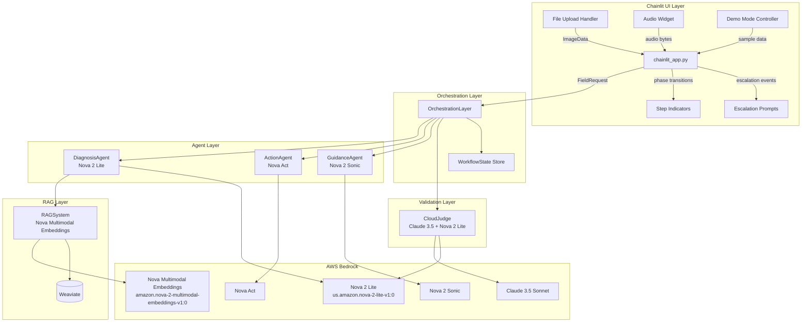
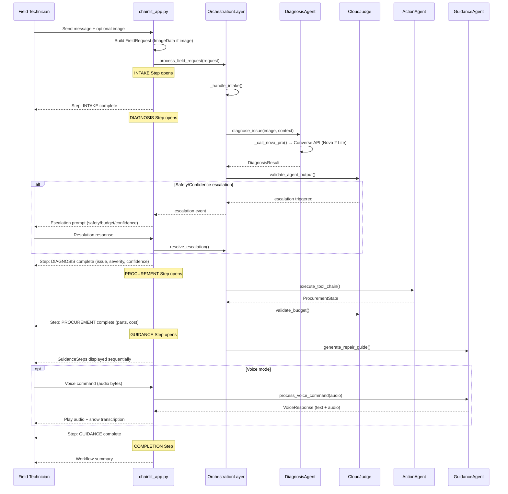

# Design Document: Chainlit UI Integration & Nova 2 Model Upgrade

## Overview

This design covers two tightly coupled changes to the Ghostwrench AFE system:

1. A Chainlit-based web chat UI (`chainlit_app.py`) that replaces the CLI entry point (`main.py`) and exposes the full multi-agent workflow (Intake → Diagnosis → Procurement → Guidance → Completion) through an interactive chat interface with image upload, escalation prompts, voice guidance, and a hackathon demo mode.

2. An Amazon Nova 2 model upgrade that switches DiagnosisAgent and CloudJudge from Nova Pro (`us.amazon.nova-pro-v1:0`) to Nova 2 Lite (`us.amazon.nova-2-lite-v1:0`) via the Bedrock Converse API, replaces Titan Embeddings + CLIP with Nova Multimodal Embeddings (`amazon.nova-2-multimodal-embeddings-v1:0`) in the RAG system, and integrates Nova 2 Sonic for speech-to-speech voice guidance.

The Chainlit app acts as a thin presentation layer. All business logic stays in the existing `OrchestrationLayer`, agents, and judge. The model upgrade is a config + API-call change — no architectural restructuring.

### Key Design Decisions

| Decision | Rationale |
|---|---|
| Single `chainlit_app.py` at project root | Mirrors `main.py` placement; `chainlit run chainlit_app.py` just works |
| Chainlit Steps for phase visualization | Native Chainlit feature — no custom widget code needed |
| Bedrock Converse API for Nova 2 Lite | Required for Nova 2 multimodal input format; replaces `invoke_model` for DiagnosisAgent |
| Unified Nova Multimodal Embeddings | Eliminates CLIP dependency; text + image share 1024-dim space for cross-modal RAG |
| In-memory session store (dict) | Sufficient for hackathon demo; no database dependency |
| `hypothesis` for property-based testing | Already in `requirements.txt`; Python-native PBT library |

## Architecture



### Request Flow



## Components and Interfaces

### 1. `chainlit_app.py` — Chainlit Entry Point

Location: `chainlit_app.py` (project root)

Responsibilities:
- Initialize `OrchestrationLayer` on chat start
- Convert Chainlit messages/file uploads into `FieldRequest` objects
- Map `WorkflowPhase` transitions to Chainlit `Step` elements
- Handle escalation prompts via `cl.AskUserMessage`
- Manage audio input/output for voice guidance phase
- Run demo mode when first message is "demo"
- Store sessions in an in-memory dict keyed by `cl.user_session`

Key Chainlit decorators/hooks used:
- `@cl.on_chat_start` — init OrchestrationLayer, welcome message
- `@cl.on_message` — route text messages to orchestration
- `@cl.on_audio_chunk` / `@cl.on_audio_end` — capture voice input during GUIDANCE phase


```python
# chainlit_app.py — key interfaces (pseudocode)

import chainlit as cl
from src.orchestration.OrchestrationLayer import OrchestrationLayer
from src.models.agents import FieldRequest, RequestType
from src.models.domain import ImageData

# In-memory session store: session_id -> WorkflowState
SESSION_STORE: Dict[str, Any] = {}

SUPPORTED_IMAGE_FORMATS = {"image/jpeg", "image/png", "image/bmp", "image/tiff"}

@cl.on_chat_start
async def on_chat_start():
    """Initialize orchestration and welcome the technician."""
    orchestration = OrchestrationLayer(enable_validation=True)
    cl.user_session.set("orchestration", orchestration)
    cl.user_session.set("session_id", generate_session_id())
    await cl.Message(content="Welcome to Ghostwrench AFE. Describe your issue or upload an equipment photo.").send()

@cl.on_message
async def on_message(message: cl.Message):
    """Route user messages to orchestration, handle demo mode, escalation responses."""
    ...

async def handle_phase_step(phase: WorkflowPhase, phase_fn, request):
    """Create a Chainlit Step, run the phase, update step on completion."""
    async with cl.Step(name=phase.value.upper()) as step:
        step.output = "Processing..."
        result = await cl.make_async(phase_fn)(request)
        step.output = format_phase_summary(phase, result)
    return result

async def handle_escalation(escalation_type, details):
    """Display escalation prompt, wait for user response, forward resolution."""
    response = await cl.AskUserMessage(content=format_escalation(escalation_type, details)).send()
    ...

async def stream_status(message: str):
    """Send an intermediate status message during long operations."""
    await cl.Message(content=message, author="system").send()
```

### 2. `config.py` — Model ID Updates

Changes to existing `config.py`:

```python
# New model IDs
NOVA_2_LITE_MODEL_ID = "us.amazon.nova-2-lite-v1:0"
NOVA_MULTIMODAL_EMBEDDINGS_MODEL_ID = "amazon.nova-2-multimodal-embeddings-v1:0"
NOVA_2_SONIC_MODEL_ID = "amazon.nova-2-sonic-v1:0"  # existing, kept for reference

# Updated MODEL_CONFIG
MODEL_CONFIG = {
    "nova_2_lite": {
        "model_id": NOVA_2_LITE_MODEL_ID,
        "max_tokens": 4096,
        "temperature": 0.7,
    },
    "claude_sonnet": {
        "model_id": CLAUDE_SONNET_MODEL_ID,
        "max_tokens": 8192,
        "temperature": 0.7,
    },
    "nova_multimodal_embeddings": {
        "model_id": NOVA_MULTIMODAL_EMBEDDINGS_MODEL_ID,
        "embedding_dimension": 1024,
    },
}
```

### 3. `DiagnosisAgent._call_nova_pro` → Converse API with Nova 2 Lite

The existing `_call_nova_pro` method uses `invoke_model` with a JSON body. It will be updated to use the Bedrock Converse API (`bedrock.converse()`) which is required for Nova 2 Lite's multimodal input format.

```python
def _call_nova_pro(self, prompt: str, image_data: Optional[bytes] = None, ...) -> str:
    content = []
    if image_data:
        content.append({
            "image": {
                "format": "jpeg",
                "source": {"bytes": image_data}  # raw bytes, not base64
            }
        })
    content.append({"text": prompt})

    response = self.bedrock.converse(
        modelId="us.amazon.nova-2-lite-v1:0",
        messages=[{"role": "user", "content": content}],
        inferenceConfig={"maxTokens": max_tokens, "temperature": temperature}
    )
    return response["output"]["message"]["content"][0]["text"]
```

Key change: `invoke_model` → `converse`. The Converse API accepts raw bytes for images (no base64 encoding needed) and uses `maxTokens` instead of `max_new_tokens`.

### 4. `CloudJudge._call_nova` → Nova 2 Lite

Same API migration as DiagnosisAgent but text-only (no image content blocks). The method switches from `invoke_model` to `converse` with the Nova 2 Lite model ID.

### 5. `RAGSystem` — Nova Multimodal Embeddings

Replace both `_generate_text_embedding` (Titan) and `_generate_image_embedding` (CLIP) with calls to `amazon.nova-2-multimodal-embeddings-v1:0` via `invoke_model`.

```python
def _generate_text_embedding(self, text: str) -> List[float]:
    response = self.bedrock.invoke_model(
        modelId="amazon.nova-2-multimodal-embeddings-v1:0",
        body=json.dumps({
            "inputText": text,
            "taskType": "SINGLE_EMBEDDING",
            "embeddingConfig": {"outputEmbeddingLength": 1024, "embeddingPurpose": "GENERIC_INDEX"}
        })
    )
    return json.loads(response["body"].read())["embedding"]

def _generate_image_embedding(self, image_data: bytes) -> List[float]:
    response = self.bedrock.invoke_model(
        modelId="amazon.nova-2-multimodal-embeddings-v1:0",
        body=json.dumps({
            "inputImage": base64.b64encode(image_data).decode("utf-8"),
            "taskType": "SINGLE_EMBEDDING",
            "embeddingConfig": {"outputEmbeddingLength": 1024, "embeddingPurpose": "GENERIC_INDEX"}
        })
    )
    return json.loads(response["body"].read())["embedding"]
```

Both methods now produce 1024-dimensional vectors in the same semantic space, enabling cross-modal similarity search without separate models.

### 6. `ActionAgent` — Nova Act Mock Inventory Portal (Computer Use Demo)

To showcase Nova Act's UI automation / "Computer Use" capabilities for the hackathon, the ActionAgent will navigate a lightweight mock "Parts Inventory Portal" web page during the PROCUREMENT phase. This demonstrates the model's ability to drive a browser session and interact with web elements — a standout feature of the Nova Act service.

**Mock Portal**: A minimal single-page HTML app (`mock_portal/index.html`) served locally that simulates an inventory search UI with:
- A search input field for part numbers/descriptions
- A results table showing part name, stock, price, lead time
- An "Add to Cart" button and a "Submit Purchase Request" button

**Nova Act Integration**: During procurement, the ActionAgent uses Nova Act to:
1. Open the mock portal URL in a headless browser session
2. Type the required part number into the search field
3. Read the search results from the page
4. Click "Add to Cart" for the matching part
5. Click "Submit Purchase Request" to complete the order

**Chainlit Visualization**: The Chainlit UI displays screenshots/status updates from each step of the browser interaction within the PROCUREMENT Step, so hackathon judges can see Nova Act driving the UI in real time.

**Implementation approach**:
- `mock_portal/` directory at project root with `index.html` + `server.py` (simple Flask/http.server)
- `ActionAgent._navigate_inventory_portal(part_query)` method that uses Nova Act's browser automation API
- Screenshots captured at each interaction step and sent to Chainlit as inline images
- Falls back to the existing tool-calling procurement flow if the portal is unavailable

### 7. `GuidanceAgent` — Nova 2 Sonic Speech-to-Speech

The existing `process_voice_command` method already has the structure for audio in → text + audio out. The update ensures it uses Nova 2 Sonic's bidirectional streaming API for real-time speech-to-speech:

- `_transcribe_audio(audio_bytes)` → sends audio to Nova 2 Sonic, receives text transcription
- `synthesize_speech(text)` → sends text to Nova 2 Sonic, receives audio bytes
- `process_voice_command(audio_bytes)` → combines both: audio in → transcription → intent classification → response generation → audio out
- Streaming support: Nova 2 Sonic returns audio chunks that can be forwarded to Chainlit's audio output as they arrive

### 8. Session Persistence Module

```python
# In chainlit_app.py
SESSION_STORE: Dict[str, WorkflowState] = {}

def save_session(session_id: str, workflow_state: WorkflowState):
    SESSION_STORE[session_id] = workflow_state

def load_session(session_id: str) -> Optional[WorkflowState]:
    return SESSION_STORE.get(session_id)
```

On reconnect, the Chainlit `@cl.on_chat_start` handler checks for an existing session ID (passed via query parameter or Chainlit's built-in session resumption) and restores the workflow state including any pending escalations.

### 9. Demo Mode Controller

When the first message is "demo", the app:
1. Creates a `FieldRequest` with pre-configured sample data (a known equipment image, site context, technician ID)
2. Runs through all 5 phases with model annotation messages before each phase (e.g., "🔍 DiagnosisAgent powered by Amazon Nova 2 Lite")
3. Formats GUIDANCE steps with highlighted safety warnings
4. Ends with a summary card listing all Nova models and hackathon categories

The demo uses the same `OrchestrationLayer.process_field_request` path — it's not a mock. The only difference is pre-loaded input data and annotation messages.

## Data Models

### New/Modified Data Structures

No new dataclass files are needed. The existing models in `src/models/` are sufficient. The Chainlit layer works with these existing types:

| Existing Type | Used By Chainlit For |
|---|---|
| `FieldRequest` | Wrapping user message + image into orchestration input |
| `ImageData` | Constructing from Chainlit file upload bytes |
| `WorkflowPhase` | Mapping to Chainlit Step names |
| `WorkflowState` | Session persistence and resumption |
| `Escalation` | Displaying escalation prompts |
| `DiagnosisResult` | Rendering diagnosis details in DIAGNOSIS step |
| `ProcurementState` | Rendering parts/cost in PROCUREMENT step |
| `RepairGuide` / `GuidanceStep` | Sequential display of repair instructions |
| `VoiceResponse` | Audio playback + transcription display |
| `AnnotatedImage` | Inline image rendering in chat |

### Config Model Changes

```python
# config.py additions
NOVA_2_LITE_MODEL_ID = "us.amazon.nova-2-lite-v1:0"           # replaces NOVA_PRO_MODEL_ID
NOVA_MULTIMODAL_EMBEDDINGS_MODEL_ID = "amazon.nova-2-multimodal-embeddings-v1:0"  # replaces Titan + CLIP
NOVA_2_SONIC_MODEL_ID = "amazon.nova-2-sonic-v1:0"            # for GuidanceAgent voice
EMBEDDING_DIMENSION = 1024                                      # unified dimension for text + image
```

### Supported Image Formats

The Chainlit upload handler validates MIME types against: `{"image/jpeg", "image/png", "image/bmp", "image/tiff"}`. This matches the formats supported by Nova 2 Lite's Converse API image content blocks.

### Escalation Prompt Structure

Escalation prompts are rendered as structured Chainlit messages. The data comes from existing `Escalation` and `JudgmentResult` dataclasses — no new models needed. The Chainlit layer formats them:

- Safety escalation: violation details, required precautions, PPE list, acknowledge button
- Budget escalation: total cost, budget limit, approval level, approve/reject/alternatives options
- Confidence escalation: diagnosis details, confidence score, confirm/reject/re-diagnose options


## Correctness Properties

*A property is a characteristic or behavior that should hold true across all valid executions of a system — essentially, a formal statement about what the system should do. Properties serve as the bridge between human-readable specifications and machine-verifiable correctness guarantees.*

### Property 1: Text message produces valid FieldRequest

*For any* non-empty text string sent as a chat message, the Chainlit message handler shall produce a `FieldRequest` with `request_type == RequestType.DIAGNOSIS`, a non-empty `session_id`, and the message text accessible in the request context.

**Validates: Requirements 1.2**

### Property 2: Image upload produces FieldRequest with ImageData

*For any* image bytes of a supported format (JPEG, PNG, BMP, TIFF), the upload handler shall produce a `FieldRequest` whose `image_data` field is an `ImageData` object containing the original bytes, a non-empty `image_id`, and a `capture_timestamp` no earlier than the upload time.

**Validates: Requirements 2.1, 2.2**

### Property 3: Unsupported image formats are rejected

*For any* file with a MIME type not in `{image/jpeg, image/png, image/bmp, image/tiff}`, the upload handler shall reject the file and return an error message that contains every supported format name.

**Validates: Requirements 2.3**

### Property 4: Exceptions produce user-friendly errors

*For any* `Exception` raised by `OrchestrationLayer.process_field_request`, the Chainlit error handler shall produce a message that does not contain Python traceback text (no "Traceback", no "File \"", no raw exception class names) and does contain a human-readable apology/retry prompt.

**Validates: Requirements 1.4**

### Property 5: WorkflowPhase maps to correct Step title

*For any* `WorkflowPhase` enum value, the phase-to-step-title mapping function shall return the phase name in uppercase (i.e., `phase.value.upper()` equals the step title).

**Validates: Requirements 3.1**

### Property 6: Phase result summaries contain required fields

*For any* `DiagnosisResult`, the formatted diagnosis summary shall contain the `issue_type`, `severity`, `confidence` score, `root_cause`, and at least one recommended action description. *For any* `ProcurementState` with non-empty `required_parts`, the formatted procurement summary shall contain the part count, `total_cost`, and `estimated_delivery_date`.

**Validates: Requirements 3.4, 3.5**

### Property 7: Escalation messages contain required fields per type

*For any* safety escalation data, the formatted message shall contain the violation description, at least one precaution, and at least one PPE item. *For any* budget escalation data, the formatted message shall contain the total cost, budget limit, and approval level. *For any* confidence escalation with a score below the threshold, the formatted message shall contain the diagnosis description and the confidence score.

**Validates: Requirements 4.1, 4.2, 4.3**

### Property 8: Escalation responses are forwarded to resolve_escalation

*For any* escalation ID and user response text, calling the escalation response handler shall invoke `OrchestrationLayer.resolve_escalation` with the matching escalation ID and the user's resolution text.

**Validates: Requirements 4.4**

### Property 9: GuidanceStep formatting contains required fields

*For any* `GuidanceStep` with a non-empty instruction, the formatted step message shall contain the `step_number`, `instruction` text, all `safety_checks` entries, and the `expected_outcome`.

**Validates: Requirements 5.3**

### Property 10: VoiceResponse escalation flag triggers escalation prompt

*For any* `VoiceResponse` where `requires_human_escalation` is `True`, the voice response handler shall trigger an escalation prompt (return value or side effect indicates escalation mode activated).

**Validates: Requirements 6.4**

### Property 11: Session IDs are unique

*For any* sequence of N new chat sessions (N ≥ 2), all generated `session_id` values shall be distinct.

**Validates: Requirements 7.1**

### Property 12: Session persistence round-trip

*For any* `WorkflowState` stored via `save_session(session_id, state)`, calling `load_session(session_id)` shall return a `WorkflowState` with the same `session_id`, `current_phase`, and `escalations` list length.

**Validates: Requirements 7.2**

### Property 13: Demo annotations contain agent and model names

*For any* `WorkflowPhase`, the demo annotation generator shall produce a string that contains both the agent name for that phase (DiagnosisAgent, ActionAgent, or GuidanceAgent) and the corresponding Nova model name (Nova 2 Lite, Nova Act, or Nova 2 Sonic).

**Validates: Requirements 8.2**

### Property 14: DiagnosisAgent Converse API request construction

*For any* text prompt and optional image bytes, the `_call_nova_pro` method shall construct a Bedrock Converse API call with `modelId == "us.amazon.nova-2-lite-v1:0"`, and when image bytes are provided, the request `content` list shall include an image content block with `format` and `source.bytes` fields before the text content block.

**Validates: Requirements 10.2, 10.4**

### Property 15: CloudJudge uses Nova 2 Lite model ID

*For any* text prompt, the `CloudJudge._call_nova` method shall construct a Bedrock API call with `modelId == "us.amazon.nova-2-lite-v1:0"`.

**Validates: Requirements 10.3**

### Property 16: RAG text embedding request format

*For any* non-empty text string, `RAGSystem._generate_text_embedding` shall call `invoke_model` with `modelId == "amazon.nova-2-multimodal-embeddings-v1:0"` and a request body containing `taskType == "SINGLE_EMBEDDING"` and `embeddingPurpose == "GENERIC_INDEX"`.

**Validates: Requirements 11.2**

### Property 17: RAG image embedding request format

*For any* non-empty image bytes, `RAGSystem._generate_image_embedding` shall call `invoke_model` with `modelId == "amazon.nova-2-multimodal-embeddings-v1:0"` and a request body containing the image as a base64-encoded string in the `inputImage` field.

**Validates: Requirements 11.3**

### Property 18: Embedding dimension consistency

*For any* text embedding returned by `_generate_text_embedding` and any image embedding returned by `_generate_image_embedding`, both vectors shall have length exactly 1024.

**Validates: Requirements 11.4**

### Property 19: Voice command produces VoiceResponse with transcription and audio

*For any* non-empty audio bytes input, `GuidanceAgent.process_voice_command` shall return a `VoiceResponse` with a non-empty `transcription` string and non-empty `audio_response` bytes.

**Validates: Requirements 12.2**

### Property 20: Text-only fallback returns valid response

*For any* non-empty text prompt when no audio input is available, `GuidanceAgent._call_nova_sonic_text` shall return a non-empty string response.

**Validates: Requirements 12.4**

### Property 21: Nova Act portal fallback on unavailability

*For any* procurement request where the mock portal is unreachable (connection refused or timeout), `ActionAgent._navigate_inventory_portal` shall fall back to the existing tool-calling flow and return a valid procurement result without raising an unhandled exception.

**Validates: Requirements 13.4**

### Property 22: Nova Act portal screenshots captured at each step

*For any* successful mock portal navigation, the `ActionAgent._navigate_inventory_portal` method shall return a list of at least 3 screenshot byte arrays (search, add-to-cart, submit) each with non-zero length.

**Validates: Requirements 13.3**

## Error Handling

### Chainlit Layer Errors

| Error Scenario | Handling Strategy |
|---|---|
| OrchestrationLayer raises exception | Catch in `on_message`, display "Something went wrong. Please try again or describe your issue differently." Log full traceback via `logger.error`. |
| Unsupported image format uploaded | Reject immediately with message listing supported formats. Do not forward to orchestration. |
| Image file too large (>10MB) | Reject with size limit message before constructing ImageData. |
| Chainlit session disconnect | WorkflowState persists in SESSION_STORE. On reconnect, restore state and re-display pending escalations. |
| Escalation timeout (>5 min) | Background task checks escalation timestamps. Send reminder message via `cl.Message`. |
| Audio input fails / empty audio | Display "Could not capture audio. Please try again or type your command." Fall back to text input. |

### Model API Errors

| Error Scenario | Handling Strategy |
|---|---|
| Nova 2 Lite Converse API failure | DiagnosisAgent catches `ClientError`/`Exception`, logs error, raises `RuntimeError` with context. Chainlit layer catches and displays user-friendly message. |
| Nova Multimodal Embeddings failure | RAGSystem falls back to cached embeddings if available. If no cache, raises error propagated to Chainlit as "RAG system temporarily unavailable." |
| Nova 2 Sonic voice API failure | GuidanceAgent falls back to `_call_nova_sonic_text` for text-only response. Chainlit displays text response and notifies user that voice is temporarily unavailable. |
| Bedrock throttling (429) | Retry with exponential backoff (3 attempts, 1s/2s/4s delays). If all retries fail, propagate error to Chainlit layer. |
| Invalid model response format | Parse with try/except, use `_create_fallback_diagnosis` / `_create_fallback_guide` patterns already in codebase. |

### Session Errors

| Error Scenario | Handling Strategy |
|---|---|
| Session ID not found on reconnect | Create new session, inform user that previous session could not be restored. |
| WorkflowState corrupted | Reset to INTAKE phase, log corruption details, inform user of restart. |
| Concurrent access to same session | In-memory dict is not thread-safe for concurrent writes. Use `asyncio.Lock` per session_id for write operations. |

## Testing Strategy

### Property-Based Testing

Library: `hypothesis` (already in `requirements.txt`)

Each correctness property from the design document maps to exactly one `hypothesis` property test. Tests use `@given` decorators with custom strategies for domain objects.

Configuration:
- Minimum 100 examples per property test (`@settings(max_examples=100)`)
- Each test tagged with a comment: `# Feature: chainlit-ui-integration, Property N: <title>`
- Test file: `tests/test_chainlit_properties.py`

Custom Hypothesis strategies needed:
- `text_messages()` — generates non-empty strings for chat messages
- `image_bytes()` — generates valid JPEG/PNG byte sequences
- `unsupported_mime_types()` — generates MIME type strings not in the supported set
- `diagnosis_results()` — generates valid `DiagnosisResult` instances
- `procurement_states()` — generates valid `ProcurementState` instances
- `escalation_data()` — generates safety/budget/confidence escalation data
- `guidance_steps()` — generates valid `GuidanceStep` instances
- `workflow_phases()` — samples from `WorkflowPhase` enum
- `workflow_states()` — generates valid `WorkflowState` instances
- `voice_responses()` — generates valid `VoiceResponse` instances

### Unit Testing

Test file: `tests/test_chainlit_unit.py`

Unit tests cover specific examples and edge cases not suited for property-based testing:

- App initialization creates OrchestrationLayer and sends welcome message (Req 1.1)
- "demo" as first message triggers demo flow (Req 8.1)
- Demo summary card contains all 5 model names and hackathon categories (Req 8.5)
- Voice command forwarding to GuidanceAgent (Req 6.2)
- Config values read from environment variables (Req 9.2)
- `config.py` contains correct model ID constants (Req 10.1, 11.1)
- `requirements.txt` includes chainlit, excludes sentence-transformers (Req 9.1, 11.5)
- Escalation reminder triggers after 5-minute timeout (Req 4.5)
- Reconnection with unresolved escalations re-displays prompts (Req 7.3)

### Integration Testing

Test file: `tests/test_chainlit_integration.py`

Integration tests verify end-to-end flows with mocked Bedrock calls:

- Full workflow: message → FieldRequest → OrchestrationLayer → response displayed
- Image upload → DiagnosisAgent receives ImageData → AnnotatedImage rendered
- Escalation flow: CloudJudge triggers → prompt displayed → user responds → workflow resumes
- Demo mode: "demo" → all 5 phases complete with annotations
- Session persistence: create session → disconnect → reconnect → state restored

### Test Organization

```
tests/
├── test_chainlit_properties.py    # 20 property-based tests (hypothesis)
├── test_chainlit_unit.py          # Unit tests for specific examples/edge cases
├── test_chainlit_integration.py   # Integration tests with mocked Bedrock
├── strategies/
│   └── chainlit_strategies.py     # Custom hypothesis strategies for domain objects
```

### Mocking Strategy

- Bedrock API calls: mock `bedrock_runtime.converse()` and `bedrock_runtime.invoke_model()` to return realistic response structures
- Chainlit framework: mock `cl.Message`, `cl.Step`, `cl.AskUserMessage` to capture sent messages without running the Chainlit server
- Weaviate: mock `weaviate.Client` for RAG embedding tests
- File uploads: use `io.BytesIO` with synthetic image headers for format validation tests
