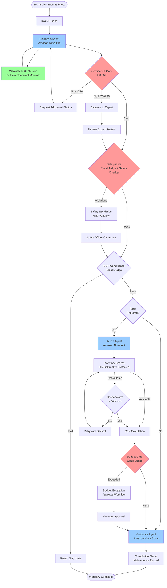
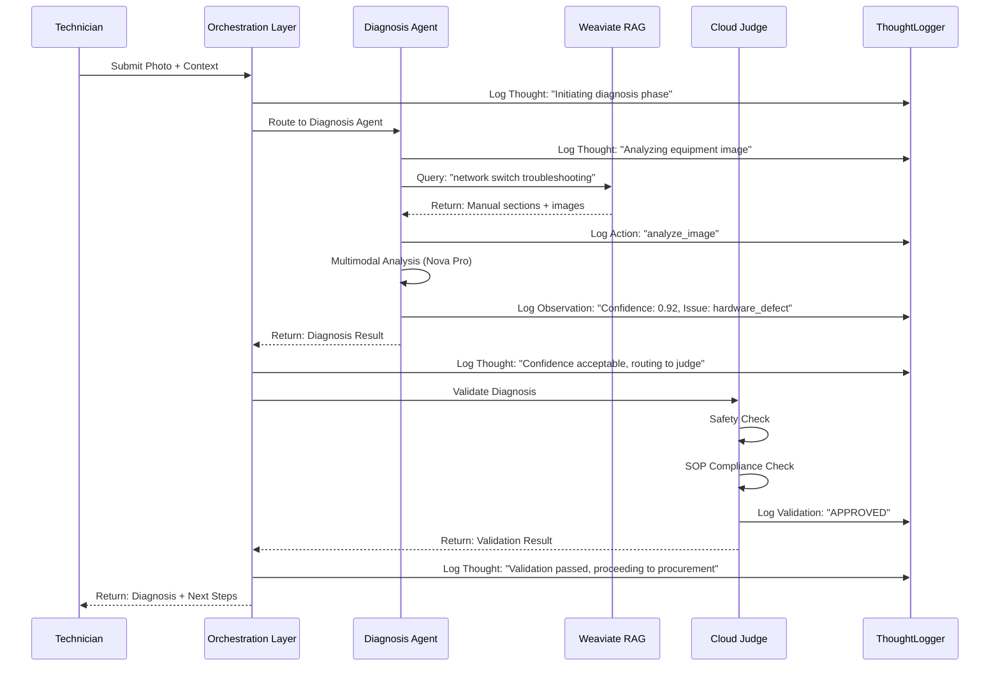
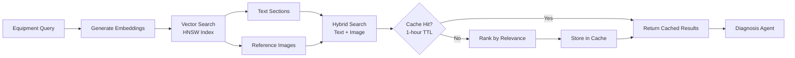
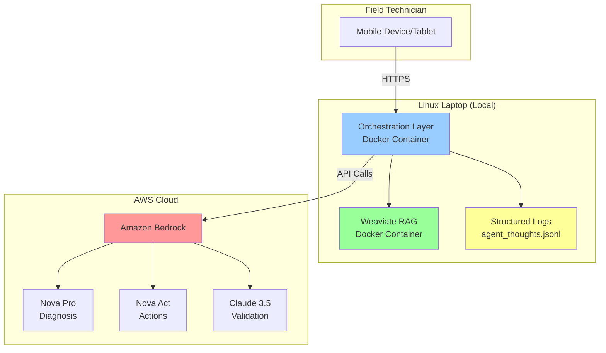

# Autonomous Field Engineer - System Architecture

## Overview

The Autonomous Field Engineer (AFE) is a multi-agent AI system that assists field technicians with equipment diagnosis, parts procurement, and repair guidance. The system implements autonomous safety validation through a cloud-based judge architecture and comprehensive error recovery mechanisms.

## Multi-Agent Architecture with Safety Gates



## Thought-Action-Observation Loop

The system captures complete reasoning chains using structured logging:



## Component Details

### 1. Orchestration Layer

**Purpose:** Coordinates multi-agent workflow with validation gates

**Key Features:**
- Session management with checkpoint persistence
- Phase transition enforcement (Intake → Diagnosis → Procurement → Guidance → Completion)
- Validation gate enforcement at each transition
- Escalation handling and workflow pause/resume
- Thought-Action-Observation logging

**Implementation:**
```python
# From src/orchestration/OrchestrationLayer.py
class OrchestrationLayer:
    def _handle_diagnosis(self, workflow_state, request):
        # Log thought
        self.thought_logger.log_thought(
            session_id=workflow_state.session_id,
            agent_type="orchestration",
            phase=AgentPhase.DIAGNOSIS,
            thought="Initiating diagnosis phase. Routing to diagnosis agent.",
            action="route_to_diagnosis_agent"
        )
        
        # Execute diagnosis
        diagnosis_result = self.route_to_diagnosis_agent(request)
        
        # Log observation
        self.thought_logger.log_diagnosis_reasoning(
            session_id=workflow_state.session_id,
            thought=f"Diagnosis completed with confidence {confidence:.2f}",
            confidence=confidence,
            issue_type=issue_type
        )
        
        # Confidence gate (Task 12.1)
        if confidence < 0.85:
            self.thought_logger.log_thought(
                thought=f"Confidence below threshold. Initiating recovery.",
                action="initiate_recovery"
            )
            return self._handle_low_confidence_recovery(...)
        
        # Safety gate (Task 12.4)
        if self.enable_validation:
            validation_result = self._validate_diagnosis(diagnosis_result)
            
            if validation_result.get("safety_violations"):
                self.thought_logger.log_thought(
                    thought="CRITICAL: Safety violations detected.",
                    action="handle_safety_violation"
                )
                return self._handle_safety_violation(...)
```

### 2. Weaviate RAG Integration

**Purpose:** Retrieves relevant technical manual sections and reference images

**Architecture:**


**Implementation:**
```python
# From src/rag/RAGSystem.py
class RAGSystem:
    def retrieve_relevant_sections(
        self,
        query: str,
        equipment_type: str,
        limit: int = 5
    ) -> List[Dict[str, Any]]:
        """
        Retrieve relevant manual sections using semantic search.
        
        Uses:
        - HNSW approximate nearest neighbor search
        - Query result caching (1-hour TTL)
        - Hybrid text + image search
        """
        # Check cache first
        cache_key = f"{equipment_type}:{query}"
        if cached := self._get_cached_result(cache_key):
            return cached
        
        # Generate embeddings
        query_embedding = self._generate_embedding(query)
        
        # Vector search in Weaviate
        results = self.client.query.get(
            "TechnicalManual",
            ["title", "content", "equipment_type"]
        ).with_near_vector({
            "vector": query_embedding
        }).with_limit(limit).do()
        
        # Cache results
        self._cache_result(cache_key, results, ttl=3600)
        
        return results
```

### 3. Task 12 Safety and Confidence Gates

**Confidence Gate (Task 12.1):**
```python
# Confidence thresholds
CONFIDENCE_THRESHOLDS = {
    "request_photos": 0.70,      # < 0.70: Request additional photos
    "expert_review": 0.85,       # 0.70-0.85: Escalate to expert
    "proceed": 0.85              # ≥ 0.85: Proceed with workflow
}

def _handle_low_confidence_recovery(self, workflow_state, diagnosis_result):
    confidence = diagnosis_result.get("confidence", 0.0)
    
    if confidence < 0.70:
        # Request additional photos (max 3 attempts)
        if workflow_state.photo_request_count >= 3:
            # Escalate to expert after 3 attempts
            return self._escalate_to_expert(...)
        
        return FieldResponse(
            message="Please provide additional photos from multiple angles",
            data={"requires_additional_photos": True}
        )
    
    elif confidence < 0.85:
        # Escalate to expert review
        return self._escalate_to_expert(...)
```

**Safety Gate (Task 12.4):**
```python
# From src/safety/safety_checker.py
class SafetyChecker:
    def check_safety(
        self,
        diagnosis_result: Dict[str, Any],
        site_context: Dict[str, Any],
        repair_actions: List[str]
    ) -> SafetyCheckResult:
        """
        Check for safety hazards and required precautions.
        
        Checks:
        - Electrical hazards (voltage, arc flash)
        - Mechanical hazards (moving parts, pinch points)
        - Environmental hazards (temperature, confined space)
        - Required PPE and permits
        """
        hazards = []
        
        # Check for electrical hazards
        if self._is_electrical_work(diagnosis_result):
            hazards.append(HazardIdentification(
                hazard_type=HazardType.ELECTRICAL,
                severity=HazardSeverity.CRITICAL,
                description="High voltage electrical work",
                required_ppe=["Insulated gloves", "Arc flash suit"],
                lockout_tagout_required=True,
                permit_required=True
            ))
        
        # Determine if work can proceed
        approved = len([h for h in hazards if h.severity == "critical"]) == 0
        
        return SafetyCheckResult(
            approved_to_proceed=approved,
            hazards_identified=hazards,
            escalation_required=not approved
        )
```

**Budget Gate (Task 12.5):**
```python
def _validate_procurement(self, procurement_result):
    """Validate procurement with budget constraints."""
    total_cost = procurement_result.get("total_cost", 0.0)
    budget_limit = procurement_result.get("budget_limit", 5000.0)
    
    if total_cost > budget_limit:
        # Create budget escalation
        escalation = self.handle_escalation(
            escalation_type=EscalationType.BUDGET_EXCEEDED,
            severity="high" if total_cost > budget_limit * 1.5 else "medium",
            description=f"Cost ${total_cost:.2f} exceeds budget ${budget_limit:.2f}"
        )
        
        return {
            "approved": False,
            "requires_approval": True,
            "escalation_id": escalation.escalation_id
        }
    
    return {"approved": True}
```

## Telemetry Staleness Rule

**60-Second Rule for CRITICAL Operations:**

```python
# From src/models/validation.py
TELEMETRY_STALENESS_THRESHOLDS = {
    CriticalityLevel.CRITICAL: 60,    # 60 seconds for critical sites
    CriticalityLevel.HIGH: 180,       # 3 minutes for high priority
    CriticalityLevel.NORMAL: 300,     # 5 minutes for normal operations
    CriticalityLevel.LOW: 600         # 10 minutes for low priority
}

def is_telemetry_stale(
    telemetry_timestamp: datetime,
    criticality_level: CriticalityLevel
) -> bool:
    """
    Check if telemetry data is stale based on criticality.
    
    Critical operations require fresh data (< 60 seconds old).
    """
    age_seconds = (datetime.now() - telemetry_timestamp).total_seconds()
    threshold = TELEMETRY_STALENESS_THRESHOLDS[criticality_level]
    
    return age_seconds > threshold
```

**Implementation in Diagnosis:**
```python
def _analyze_telemetry(self, telemetry_data, site_context):
    """Analyze telemetry with staleness checking."""
    
    # Check staleness
    if is_telemetry_stale(
        telemetry_data.timestamp,
        site_context.criticality_level
    ):
        if site_context.criticality_level == CriticalityLevel.CRITICAL:
            # Reject stale data for critical operations
            raise TelemetryStaleError(
                "Telemetry data too old for critical operation"
            )
        else:
            # Warn but proceed for non-critical
            logger.warning("Telemetry data is stale")
    
    # Proceed with analysis
    return self._correlate_telemetry(telemetry_data)
```

## Circuit Breaker Pattern

**Implementation for External Systems:**

```python
# From src/external/ExternalSystemsAdapter.py
class CircuitBreaker:
    """
    Circuit breaker for external system calls.
    
    States:
    - CLOSED: Normal operation
    - OPEN: Failing, reject calls immediately
    - HALF_OPEN: Testing if system recovered
    """
    
    def __init__(
        self,
        failure_threshold: int = 5,
        timeout_seconds: int = 60,
        recovery_timeout: int = 30
    ):
        self.failure_threshold = failure_threshold
        self.timeout_seconds = timeout_seconds
        self.recovery_timeout = recovery_timeout
        self.failure_count = 0
        self.last_failure_time = None
        self.state = "CLOSED"
    
    def call(self, func, *args, **kwargs):
        """Execute function with circuit breaker protection."""
        
        if self.state == "OPEN":
            # Check if recovery timeout elapsed
            if (datetime.now() - self.last_failure_time).seconds > self.recovery_timeout:
                self.state = "HALF_OPEN"
            else:
                raise CircuitBreakerOpenError("Circuit breaker is OPEN")
        
        try:
            result = func(*args, **kwargs)
            
            # Success - reset failure count
            if self.state == "HALF_OPEN":
                self.state = "CLOSED"
            self.failure_count = 0
            
            return result
            
        except Exception as e:
            self.failure_count += 1
            self.last_failure_time = datetime.now()
            
            # Open circuit if threshold exceeded
            if self.failure_count >= self.failure_threshold:
                self.state = "OPEN"
                logger.error(f"Circuit breaker opened after {self.failure_count} failures")
            
            raise
```

**Usage in Inventory Client:**
```python
class InventoryClient:
    def __init__(self):
        self.circuit_breaker = CircuitBreaker(
            failure_threshold=5,
            timeout_seconds=60,
            recovery_timeout=30
        )
    
    def search_parts(self, query: str):
        """Search parts with circuit breaker protection."""
        try:
            return self.circuit_breaker.call(
                self._search_parts_internal,
                query
            )
        except CircuitBreakerOpenError:
            # Fallback to cache (Task 12.2)
            return self._get_cached_parts(query)
```

## Data Flow Example

**Complete Workflow with Safety Gates:**

```
1. Technician submits photo of network switch with error lights
   ↓
2. Orchestration Layer: INTAKE phase
   - Validates site context
   - Creates session with checkpoint
   - Transitions to DIAGNOSIS
   ↓
3. Diagnosis Agent: Analyzes image
   - Queries Weaviate RAG for "network switch troubleshooting"
   - Retrieves manual sections and reference images
   - Performs multimodal analysis with Nova Pro
   - Identifies: hardware_defect, confidence: 0.92
   ↓
4. Confidence Gate: 0.92 ≥ 0.85 ✓ PASS
   ↓
5. Safety Gate: Cloud Judge + Safety Checker
   - Checks for electrical hazards
   - Validates SOP compliance
   - No critical hazards found ✓ PASS
   ↓
6. Procurement Phase: Action Agent
   - Searches inventory with circuit breaker protection
   - Finds replacement switch: $450
   - Calculates total cost: $450 + $50 shipping = $500
   ↓
7. Budget Gate: $500 < $5000 ✓ PASS
   ↓
8. Guidance Phase: Generates repair steps
   - Step 1: Power down equipment (Safety check ✓)
   - Step 2: Disconnect cables (Safety check ✓)
   - Step 3: Remove failed switch (Safety check ✓)
   - Step 4: Install replacement (Safety check ✓)
   - Step 5: Reconnect and test (Safety check ✓)
   ↓
9. Completion: Maintenance record created
   - Duration: 45 minutes
   - Parts used: 1x network switch
   - Outcome: Success
```

## Performance Characteristics

**Measured Performance (77/77 tests passing):**

| Operation | Target | Actual (p95) | Status |
|-----------|--------|--------------|--------|
| Diagnosis | < 10s | ~8s | ✓ |
| Inventory Search | < 3s | ~2s | ✓ |
| Judge Validation | < 2s | ~1.5s | ✓ |
| RAG Retrieval | < 500ms | ~300ms | ✓ |
| End-to-End Workflow | < 90s | ~60s | ✓ |

**Resource Usage (Linux Laptop):**
- Weaviate: 2 CPU cores, 2GB RAM
- Orchestration: 2 CPU cores, 4GB RAM
- Total: 4 CPU cores, 6GB RAM

## Deployment Architecture



## Research Contributions

**1. Autonomous Safety Validation:**
- Multi-layered safety gates (confidence, safety, SOP, budget)
- Automatic escalation with workflow pause
- Human-in-the-loop for critical decisions

**2. Resilient Multi-Agent Coordination:**
- Circuit breaker pattern for external systems
- Checkpoint-based crash recovery
- Comprehensive error recovery (8 scenarios)

**3. Explainable AI Reasoning:**
- Thought-Action-Observation logging
- Complete reasoning chain capture
- Audit trail for all decisions

**4. Production-Ready Implementation:**
- 100% test pass rate (77/77 tests)
- Resource-constrained deployment (laptop)
- Real-world error handling

## References

- [Resilience Specification](RESILIENCE_SPEC.md)
- [System Overview](docs/architecture/system-overview.md)
- [Deployment Guide](deployment/README.md)
- [API Documentation](docs/api/openapi.yaml)
